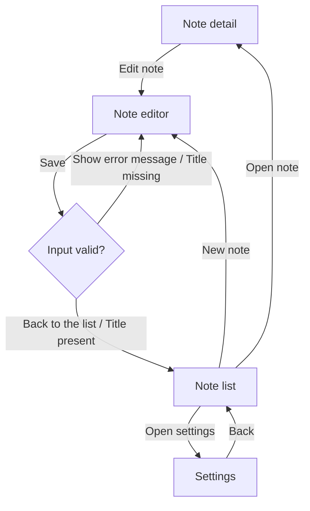

<div align="center">

# Ductus

[English](./README.md) | [Deutsch](./README.de.md) | **Español** | [简体中文](./README.zh-CN.md)

**Documentación para usuarios finales que no puede mentir — extraída de tu código, anclada en el grafo del journey, traducida por un LLM con tu propia clave de API.**

[](https://github.com/PlaxXOnline/ductus/actions/workflows/ci.yml?query=branch%3Amain)
[](https://www.npmjs.com/package/@ductus/core)
[](https://pub.dev/packages/ductus)
[](https://pub.dev/packages/ductus/score)
[](packages/core/package.json)
[](dart/ductus/pubspec.yaml)
[](LICENSE)

**[Ver la demo en vivo →](https://plaxxonline.github.io/ductus/)** · [Inicio rápido](#inicio-rápido) · [Con o sin LLM](#con-o-sin-llm) · [Capa LLM](#la-capa-llm-en-detalle) · [Paquetes](#paquetes)

</div>

<picture>
  <source media="(prefers-color-scheme: dark)" srcset="docs/assets/pipeline-dark.svg">
  
</picture>

La documentación para usuarios finales se queda obsoleta más rápido de lo
que se escribe: cada nueva ruta, cada botón renombrado invalida las guías en
silencio. Por eso Ductus extrae un grafo dirigido del user journey
directamente del código fuente anotado (Dart/Flutter y
TypeScript/JavaScript) y lo traduce mediante un LLM — con tu propia clave de
API (BYOK) — a documentación para usuarios finales bien cuidada, como
archivos MDX o como sitio web estático. El grafo y la documentación se
versionan junto con el código; un **faithfulness judge** garantiza que el
texto generado no afirme nada que no esté en el grafo.

- **Sin backend, sin cuenta:** todo se ejecuta localmente a través de la
  CLI. Los proveedores de LLM compatibles son `anthropic`, `openai`,
  `mistral`, un endpoint compatible con OpenAI (`custom` + `baseUrl` —
  incluidos endpoints locales, p. ej. Ollama) o `mock` (determinista y sin
  red — para tests/CI).
- **Generación anclada al grafo:** el LLM solo traduce el grafo validado;
  el faithfulness judge compara la salida con él y marca de forma visible
  las afirmaciones sin cobertura, tanto en la salida como en el informe.
- **Núcleo agnóstico del lenguaje + adaptadores de lenguaje** (como
  LSP/tree-sitter): un adaptador es una CLI independiente que emite
  exactamente un JSON canónico del grafo por stdout. Los lenguajes nuevos
  solo necesitan un adaptador así — sin cambios en el núcleo.

## Demo en vivo

El **[sitio de demostración](https://plaxxonline.github.io/ductus/)** fue
generado íntegramente por Ductus — a partir de los comentarios `@journey:`
de la app de ejemplo
[`examples/flutter_comment_demo`](examples/flutter_comment_demo), sin
retoques manuales. Grafo del journey interactivo, lista de pasos del camino
principal, búsqueda ⌘K:

<a href="https://plaxxonline.github.io/ductus/journeys/notes/">
  
</a>

La insignia de advertencia en la esquina superior derecha también forma
parte de la demo: el judge de faithfulness del modelo de demostración
(deliberadamente diminuto) plantea tres hallazgos excesivamente estrictos —
señala pasos perfectamente válidos como «Tap **New note**…» porque no los
reconoce como botones del grafo. Ductus muestra esos veredictos de forma
transparente en lugar de ocultarlos.

## Inicio rápido

```bash
# En tu proyecto Flutter (con go_router):
dart pub add ductus                # anotaciones + adaptador
npm install -g @ductus/core @ductus/adapter-dart

ductus init                        # detecta pubspec.yaml, escribe ductus.config.yaml
ductus extract                     # → journey-graph.json (utilizable sin LLM)
export DUCTUS_LLM_API_KEY=sk-…
ductus generate                    # → docs/*.mdx (o un sitio web)
ductus graph --open                # inspecciona el grafo como Mermaid/HTML
```

En un proyecto TypeScript/JavaScript (p. ej. React + react-router) la parte
de Dart desaparece por completo:

```bash
npm install -g @ductus/core @ductus/adapter-typescript
ductus init && ductus extract && ductus generate
```

Así se ve una ejecución completa — `extract` y `check` no necesitan LLM, y
`generate` indica su estimación de costes antes de la primera llamada al
proveedor:


## Con o sin LLM

Ductus es **totalmente utilizable sin LLM** — el LLM es la última milla que
convierte el grafo validado en prosa legible. Una comparación directa, con
artefactos reales (literales) de
[`examples/flutter_comment_demo`](examples/flutter_comment_demo):

### Punto de partida: un comentario en el código

```dart
// @journey:screen id="note-editor" title="Note editor" flow="notes"
//   description="Form for creating or editing a note with a title and content."
class NoteEditorScreen extends StatelessWidget {
  // …
            // @journey:action label="Save"
            //   from="note-editor" to="save-check" trigger="submit"
            FilledButton(
              onPressed: () => _save(context, titleController.text),
              child: const Text('Save'),
            ),
```

### Sin LLM: `ductus extract` + `ductus graph` — coste cero, sin red

`extract` produce el grafo validado en una serialización estable a nivel de
bytes — un extracto de `journey-graph.json`, recortado a un nodo y una
arista:

```json
{
  "edges": [
    {
      "from": "note-editor",
      "id": "e_note-editor_save-check",
      "label": "Save",
      "source": "annotation",
      "sourceRef": {
        "file": "lib/screens/note_editor_screen.dart",
        "line": 44,
        "symbol": "NoteEditorScreen"
      },
      "to": "save-check",
      "trigger": "submit"
    }
  ],
  "nodes": [
    {
      "description": "Form for creating or editing a note with a title and content.",
      "flow": "notes",
      "id": "note-editor",
      "source": "annotation",
      "sourceRef": {
        "file": "lib/screens/note_editor_screen.dart",
        "line": 3,
        "symbol": "NoteEditorScreen"
      },
      "title": "Note editor",
      "type": "screen"
    }
  ]
}
```

`ductus graph` lo convierte en Mermaid — esta es la salida sin modificar
para la app de demostración:



A eso se suman la validación (pantallas de inicio, nodos inalcanzables,
ciclos sin `condition`, …) y `ductus-report.json` como puerta de CI legible
por máquina.

### Con LLM: `ductus generate` — el mismo grafo se convierte en prosa

Generado literalmente (a propósito con un modelo muy pequeño,
`ministral-3b-2512`; extracto de la ejecución actual de la app de
demostración):

> This section guides you through creating, editing, and managing notes in
> **comment_demo**. You’ll start from the note list, explore note details,
> and adjust app settings as needed.
>
> …
>
> **Creating a New Note**
>
> 1. Tap **New note** on the **Note list** screen.
> 2. You’re taken to the **Note editor** screen.
>
> …
>
> **Editing the Note**
>
> 1. Tap **Edit note** on the **Note detail** screen.
> 2. You’re redirected to the **Note editor** screen.
>
> **Saving with a Title**
>
> 1. In the **Note editor**, ensure the note has a title.
> 2. Submit the form to proceed to the **Input valid?** decision node.
> 3. The app confirms the title is present and takes you back to the
>    **Note list**.

Las etiquetas de las aristas (**New note**, **Edit note**) son los rótulos
reales de los botones tal como están en el grafo — el prompt de generación
prohíbe al LLM inventar elementos de UI que no aparezcan como nodo, arista o
`label` en el segmento.

### La diferencia de un vistazo

|  | `extract` / `graph` / `check` | `generate` |
|---|---|---|
| **LLM / clave de API** | no se necesita | tu propia clave (BYOK) o `mock` |
| **Coste** | ninguno | estimación previa; la caché de segmentos evita cargos repetidos |
| **Red** | ninguna | solo la llamada al proveedor |
| **Resultado** | `journey-graph.json`, diagramas Mermaid, validación, informe | prosa para usuarios finales como MDX o sitio web |
| **Uso** | puerta de CI, revisión, mantenimiento del grafo | publicación de la documentación |

### ¿Y si el LLM alucina?

Dos capas de comprobaciones protegen el texto generado. Una **comprobación
determinista de vocabulario** (sin LLM) compara cada elemento `**en
negrita**` marcado como UI en las líneas de pasos con el vocabulario del
grafo — un botón inventado destaca con garantía. Además, una segunda llamada
al LLM — el **faithfulness judge** — comprueba si el texto afirma pasos,
condiciones o elementos de UI que no están en el segmento del grafo. Al
propio judge tampoco se le cree sin más: cada hallazgo debe citar el pasaje
literalmente y nombrar el elemento que falta; ambos se verifican
mecánicamente, los hallazgos refutados se descartan y los casos límite se
conservan solo como notas. Los aciertos confirmados aparecen de forma
visible en la salida y en el informe:

```mdx
:::caution[Faithfulness warning]
The faithfulness judge found claims that are not covered by the journey graph:
- Click “Forgot password”: no such step in the graph.
:::
```

`llm.faithfulnessThreshold` (predeterminado `0`) convierte esto en una
puerta dura de CI: `generate`/`check` terminan con código 2 en cuanto el
número de violaciones supera el umbral.
Un fallo del propio judge (una respuesta no parseable) también cuenta, de
forma conservadora, como violación — mejor una advertencia falsa que una
aprobación silenciosa.

## La capa LLM en detalle

**BYOK — bring your own key.** Ductus no tiene backend ni cuenta; todos los
proveedores se llaman mediante `fetch` nativo, sin SDKs. La clave de API
vive exclusivamente en una variable de entorno (la configuración solo
conoce su **nombre**, `llm.apiKeyEnv`), nunca se registra en logs, nunca se
persiste y se elimina de los mensajes de error.

| Proveedor | Endpoint | Notas |
|---|---|---|
| `anthropic` | `api.anthropic.com/v1/messages` | predeterminado; `model` usa `claude-sonnet-4-5` por defecto |
| `openai` | `api.openai.com/v1/chat/completions` | define `llm.model` explícitamente |
| `mistral` | `api.mistral.ai/v1/chat/completions` | define `llm.model` explícitamente |
| `custom` | `<llm.baseUrl>/chat/completions` | compatible con OpenAI; clave opcional — también endpoints locales (Ollama, LM Studio) |
| `mock` | — | determinista y sin red; para tests, CI y `--offline` |

**Los costes se mantienen bajo control:**

- **Estimación antes de la ejecución:** `generate` imprime
  `Cost estimate (upfront): …` antes de la primera llamada al proveedor —
  con `llm.pricing` configurado (precio por 1M de tokens de entrada/salida)
  también en USD.
- **Caché de segmentos:** el grafo se divide en segmentos (por flow o por
  pantalla); la clave de caché es un SHA-256 sobre el JSON canónico del
  segmento más la versión del prompt, el modelo, la `voice` y el `locale`.
  Los segmentos sin cambios salen de `.ductus/cache` — una nueva ejecución
  de `generate` tras cambios pequeños en el grafo solo paga por los
  segmentos modificados.
- **`ductus check` es gratis:** valida y lee el faithfulness desde la caché
  de segmentos — sin una sola llamada al LLM. Ideal para CI.

**Prompts anclados al grafo:** segmentos más cortos y ligados al grafo, en
lugar de un único prompt monolítico, reducen las alucinaciones y los
costes. El prompt de sistema fija el rol («technical writer»), el idioma de
destino y la `voice` (`en-you`, el valor predeterminado, o `formal-sie` /
`informal-du` para documentación de usuario final en alemán), prohíbe los
elementos de UI inventados y exige que las lagunas se señalen
explícitamente en lugar de rellenarse.

**Códigos de salida** (todos los comandos):

| Código | Significado |
|---|---|
| `0` | éxito |
| `1` | error de validación o conflicto de fusión entre salidas de adaptadores |
| `2` | violaciones de faithfulness por encima de `llm.faithfulnessThreshold` |
| `3` | error de configuración, del LLM, de un adaptador o de la compilación del sitio web |

## CLI

| Comando | Propósito |
|---|---|
| `ductus init [--force]` | Escribe el `ductus.config.yaml` comentado (solo sobrescribe con `--force`) |
| `ductus extract` | Ejecuta los adaptadores, fusiona + valida → `journey-graph.json` y `ductus-report.json` |
| `ductus generate [--build]` | extract + generación con LLM → MDX o sitio web; `--build` compila el sitio web exportado |
| `ductus check` | Validación + faithfulness desde la caché de segmentos — sin llamadas al LLM, sin coste (CI) |
| `ductus graph [--open] [--out <path>] [--journey]` | Mermaid por stdout; `--open` renderiza HTML en `.ductus/graph.html`; `--journey` imprime los caminos principales de los flows como diagramas `journey` |
| `ductus help [command]` | Imprime un resumen detallado de la CLI — o, con el nombre de un comando, la ayuda de ese comando |

Opciones globales: `-c, --config <path>` (predeterminado
`./ductus.config.yaml`) y `--offline` — con esta última, `generate` solo se
permite con `llm.provider: mock`, `extract`/`check`/`graph` se ejecutan de
todos modos completamente en local, y `--build` no puede combinarse con
ella (npm necesitaría la red).

## Vías de entrada

Cuatro vías alimentan el grafo; pueden combinarse libremente (detalles y
configuración: [dart/ductus](dart/ductus) para Dart/Flutter,
[packages/adapter-typescript](packages/adapter-typescript) para
TypeScript/JavaScript):

| Vía | Mecanismo | Lenguajes | Ideal para |
|---|---|---|---|
| **A — convención de comentarios** | `// @journey:screen id="…" title="…"` | Dart **y** TS/JS | Sin build, sin dependencia en el proyecto de destino |
| **B — anotaciones de Dart** | `@JourneyScreen`, `@JourneyAction`, `@JourneyDecision`, `@JourneyFlow` | Solo Dart | Seguridad de tipos; `ductus` como dependencia normal |
| **C — derivación automática** | análisis de go_router/auto_route o react-router/Next.js | Dart **y** TS/JS | Un esqueleto sin ninguna anotación |
| **D — builder de build_runner** | `journey_builder` → `ductus_builder.g.json` | Solo Dart | Resuelve argumentos constantes no literales de las anotaciones |

En TypeScript/JavaScript existen deliberadamente solo A y C: el lenguaje no
necesita ni anotaciones tipadas (B) ni un builder (D) — allí la vía A es la
ruta manual y la vía C deriva el esqueleto de react-router o Next.js.

Regla de fusión: las anotaciones manuales sobrescriben los valores
derivados campo por campo (con el mismo ID); si dos fuentes **manuales** se
contradicen, la ejecución se aborta en modo fail-fast con ambas referencias
de origen.

**Uso sin build:** con la convención de comentarios el proyecto de destino
no necesita ninguna dependencia — basta una instalación global:

```bash
# Dart/Flutter:
dart pub global activate ductus
npm install -g @ductus/core @ductus/adapter-dart
ductus extract

# TypeScript/JavaScript (el adaptador solo parsea de todos modos):
npm install -g @ductus/core @ductus/adapter-typescript
ductus extract
```

## Modo sitio web

Con `output.format: website`, `ductus generate` exporta un proyecto Astro
completo a `output.dir`. El generador predeterminado es
[`journey`](templates/journey): una plantilla centrada en el journey, en
Astro puro, que lee sus datos de exactamente un `ductus.data.json` (un
contrato de datos determinista — sin archivos MDX). Con
`output.website.generator: starlight` obtienes en su lugar un
[proyecto Starlight](templates/starlight) (MDX + configuración de barra
lateral/sitio) en el que los diagramas Mermaid se renderizan en el cliente.

<p>
  <a href="https://plaxxonline.github.io/ductus/"></a>
  <a href="https://plaxxonline.github.io/ductus/journeys/notes/"></a>
</p>

La plantilla journey incluye: grafos de journey interactivos (nodos
clicables, una animación «play path», enlaces profundos), búsqueda ⌘K en
journeys, pasos, decisiones y acciones, banners de faithfulness, una
referencia de origen por paso (`file:line · symbol`), un diseño responsivo
y soporte de `prefers-reduced-motion`. Su UI está en inglés por defecto y
cambia a alemán cuando el `locale` configurado empieza por `de`. El
Markdown del LLM se renderiza de forma segura frente a XSS en tiempo de
compilación.

`ductus generate --build` instala las dependencias en el proyecto exportado
y ejecuta `npm run build` — el sitio web terminado, hospedable de forma
puramente estática, queda entonces en `<output.dir>/dist`. La
[demo en vivo](https://plaxxonline.github.io/ductus/) se produce de la
misma manera: un
[workflow de GitHub Actions](.github/workflows/pages.yml) ensambla la
plantilla journey con el [`demo/ductus.data.json`](demo) versionado en el
repositorio y la compila estáticamente (`astro build`).

### Diagramas en la documentación generada

Con `output.website.diagrams: true` (el valor predeterminado), cada página
de flow en modo MDX o Starlight recibe hasta dos secciones Mermaid: el
**camino principal** (un diagrama `journey` lineal) y el **flowchart** del
segmento completo. El camino principal se deriva de forma determinista:
partiendo de `flow.start`, Ductus elige exactamente una arista saliente por
paso — los triggers que no son `back` antes que `back`, las aristas sin
`condition` antes que las que tienen una, y el `edge.id` más pequeño en
caso de empate. La plantilla journey no necesita los diagramas Mermaid:
renderiza el grafo de forma nativa como vista interactiva directamente
desde `ductus.data.json`.

## Configuración

`ductus init` lee tu `pubspec.yaml` (nombre de la app,
go_router/auto_route) — o, si no existe, tu `package.json` (nombre de la
app, react-router/Next.js) — y escribe un `ductus.config.yaml` comentado:

```yaml
app:
  name: MyApp
  locale: en

adapters:
  - dart:                      # o typescript: en proyectos TS/JS
      project: .
      deriveFrom: [go_router, auto_route]

llm:
  provider: anthropic          # anthropic | openai | mistral | custom | mock
  model: claude-sonnet-4-5
  apiKeyEnv: DUCTUS_LLM_API_KEY
  temperature: 0.2
  faithfulnessCheck: true

style:
  voice: en-you                # formal-sie | informal-du | en-you
  granularity: flow            # flow | screen

output:
  format: mdx                  # mdx | website
  dir: docs/
  website:
    generator: journey         # journey | starlight
    diagrams: true
```

Detalles que conviene conocer:

- `app.locale` (predeterminado `en`) es el idioma de la documentación
  generada; `style.voice` (predeterminado `en-you`) fija la forma de
  tratamiento — `formal-sie` e `informal-du` producen documentación de
  usuario final en alemán.
- `llm.apiKeyEnv` contiene el **nombre** de la variable de entorno, nunca
  la clave misma; `llm.baseUrl` es obligatorio con `provider: custom`.
- `llm.faithfulnessThreshold` (predeterminado `0`) determina cuántos
  hallazgos del judge hacen que `generate`/`check` terminen con código 2;
  `llm.maxTokens` (predeterminado `2048`) limita la longitud de la
  respuesta por llamada.
- `llm.pricing` (`inputPerMTokUsd`/`outputPerMTokUsd`) es opcional y
  convierte la estimación de tokens en una estimación de costes en USD.
- `output.website.generator: docusaurus` se acepta pero no está incluido en
  la fase 1 — la ejecución se aborta con una indicación hacia
  `journey`/`starlight`.

## Buenas prácticas

Cómo obtener de Ductus documentación para usuarios finales precisa, fiel al
grafo y económica.

### Calidad del grafo

- **Mantén los IDs estables; nunca los reutilices con otro significado.**
  Los IDs son la identidad de fusión, parte de la clave de la caché de
  segmentos y la clave de ordenación de la salida canónica — un ID
  renombrado significa: el segmento se regenera (coste de LLM) y el diff se
  llena de ruido. Los IDs descriptivos en kebab-case como `submit-login`
  encajan con el estilo de los IDs derivados.
- **Escribe los títulos y las `description` desde la perspectiva del
  usuario final, no desde los detalles internos del código.** El
  faithfulness judge solo comprueba si el texto afirma algo que *no* está
  en el grafo — lo que está en el grafo acaba en la documentación. Las
  `description` que faltan se notifican como advertencia de validación
  (V5), porque la calidad del LLM baja.
- **`label` de arista = el texto visible en la UI.** Solo el rótulo real
  del botón produce «Toca **Iniciar sesión**» en lugar de una paráfrasis
  vaga.
- **Asigna cada nodo a un flow y una `condition` a cada arista de
  decisión.** Los nodos sin flow se acumulan en una página cajón de sastre
  sin diagrama del camino principal. La validación también advierte (V5) de
  nodos inalcanzables y de ciclos en los que ninguna arista lleva una
  `condition`; `flow.start` debe existir y ser una pantalla (V3, error
  duro).

### Combinar las vías de entrada

- **La derivación como base, las anotaciones para afinar.** La derivación
  automática desde go_router/auto_route o react-router/Next.js proporciona
  el esqueleto; las anotaciones manuales sobrescriben los valores derivados
  campo por campo. Para enriquecer un nodo derivado, la anotación debe usar
  **el mismo ID** — los IDs derivados están en `journey-graph.json` tras
  `ductus extract`.
- **Nunca dos fuentes manuales para el mismo campo.** Si dos fuentes
  manuales se contradicen, la fusión se aborta en modo fail-fast con ambas
  referencias de origen. Describe cada elemento manualmente exactamente una
  vez.
- **La vía D para proyectos con build_runner:** si de todos modos ejecutas
  `build_runner`, deja que el builder `journey_builder` emita el grafo como
  `ductus_builder.g.json` e intégralo mediante `fromBuilder: true` — con
  resolución de argumentos constantes no literales de las anotaciones que
  un adaptador que solo parsea tendría que rechazar (configuración en
  [dart/ductus](dart/ductus)).

### Flujo de trabajo

- **Primero deja `extract` en verde, luego `generate`.** `ductus extract` y
  `ductus graph --open` se ejecutan sin LLM y no cuestan nada — corrige
  primero los errores y advertencias de validación, inspecciona el grafo y
  solo entonces genera.
- **Versiona `journey-graph.json` y la documentación generada junto con el
  código.** El grafo se serializa de forma estable a nivel de bytes
  (ordenación determinista, LF, orden de campos estable) — los cambios
  quedan visibles como diffs limpios en la revisión.
- **No edites a mano la documentación generada.** La siguiente ejecución de
  `generate` reescribe las páginas. Las correcciones pertenecen al grafo —
  también en el caso de las advertencias de faithfulness `:::caution`:
  afina `description`, `label` y `condition` en lugar de parchear el texto.
- **Ejecuta `ductus check` en CI.** Sin llamadas al LLM, sin coste; se
  aplican los [códigos de salida de arriba](#la-capa-llm-en-detalle). Los
  segmentos sin entrada en la caché solo se notifican como «not generated
  yet» (el código de salida sigue siendo 0).

### LLM y costes

- **Los IDs y títulos estables evitan la regeneración.** Cambiar el modelo,
  la `voice`, el `locale` o la `granularity`, en cambio, invalida todos los
  segmentos.
- **Mantén la `temperature` baja y `faithfulnessCheck` activado** (valores
  predeterminados `0.2` y `true`).
- **Tests/CI a coste cero:** `llm.provider: mock` (determinista, sin red)
  más `--offline`.

## Paquetes

| Paquete | Versión | Código fuente | Contenido |
|---|---|---|---|
| `@ductus/schema` | [](https://www.npmjs.com/package/@ductus/schema) | [packages/schema](packages/schema) | JSON Schema del grafo + tipos TypeScript |
| `@ductus/core` | [](https://www.npmjs.com/package/@ductus/core) | [packages/core](packages/core) | CLI `ductus`: fusión/validación, capa LLM, exportación MDX/sitio web |
| `@ductus/adapter-dart` | [](https://www.npmjs.com/package/@ductus/adapter-dart) | [packages/adapter-dart](packages/adapter-dart) | Wrapper delgado que delega en la CLI del adaptador de Dart |
| `@ductus/adapter-typescript` | [](https://www.npmjs.com/package/@ductus/adapter-typescript) | [packages/adapter-typescript](packages/adapter-typescript) | Adaptador TS/JS: comentarios `@journey:` + derivación desde react-router/Next.js |
| `ductus` | [](https://pub.dev/packages/ductus) | [dart/ductus](dart/ductus) | Anotaciones de Dart, CLI del adaptador, builder de build_runner |

Todos los paquetes tienen [licencia MIT](LICENSE) (cada paquete incluye su
propio archivo LICENSE).

## Ejemplos

Las [apps de ejemplo](examples) muestran las vías de entrada en acción:

- [`flutter_comment_demo`](examples/flutter_comment_demo) — convención de
  comentarios puramente sin build (vía A); origen de la [demo en vivo](https://plaxxonline.github.io/ductus/)
- [`flutter_go_router_demo`](examples/flutter_go_router_demo) — derivación
  desde go_router (vía C) + anotaciones de Dart (vía B)
- [`react_router_demo`](examples/react_router_demo) — React + react-router:
  derivación (vía C) + comentarios `@journey:` (vía A)

## Estructura del repositorio y desarrollo

```
packages/{schema,core,adapter-dart,adapter-typescript}   # paquetes npm (TypeScript)
dart/ductus                                              # paquete de pub.dev (anotaciones + adaptador + builder)
templates/                                               # plantillas de sitio web (journey = predeterminada, starlight)
examples/                                                # apps de ejemplo con anotaciones
demo/                                                    # fuente de datos de la demo de GitHub Pages
```

```bash
npm install && npm run build && npm test      # paquetes TS
cd dart/ductus && dart pub get && dart test   # adaptador de Dart
```

La CI ([.github/workflows/ci.yml](.github/workflows/ci.yml)) ejecuta en
cada push y pull request jobs de Node (build + Vitest), jobs de Dart
(`dart analyze` + `dart test`) y jobs de análisis de Flutter. Las releases
pasan por [Changesets](RELEASING.md) con npm trusted publishing; por favor,
[informa de las vulnerabilidades de seguridad de forma privada](SECURITY.md).

## Licencia

[MIT](LICENSE) para todos los paquetes de este repositorio.
