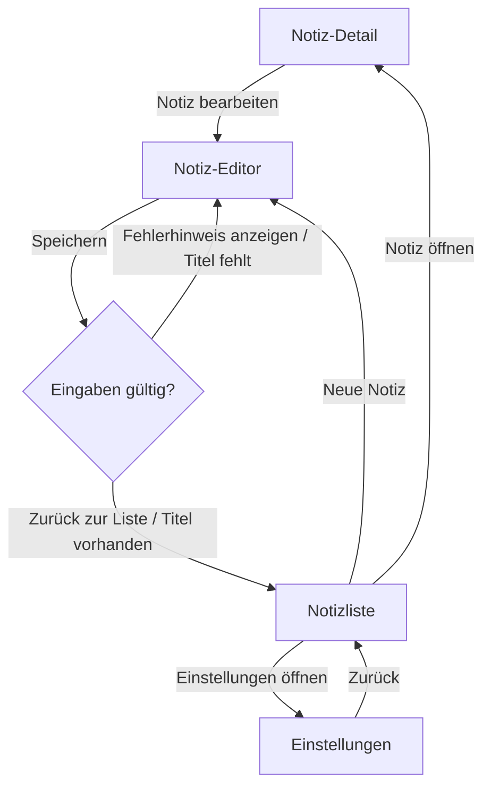

<div align="center">

# Ductus

**Endnutzer-Dokumentation, die nicht lügen kann — extrahiert aus dem Code, geerdet im Journey-Graphen, übersetzt per LLM mit eigenem API-Key.**

[](https://github.com/PlaxXOnline/ductus/actions/workflows/ci.yml?query=branch%3Amain)
[](https://www.npmjs.com/package/@ductus/core)
[](https://pub.dev/packages/ductus)
[](https://pub.dev/packages/ductus/score)
[](packages/core/package.json)
[](dart/ductus/pubspec.yaml)
[](LICENSE)

**[Live-Demo ansehen →](https://plaxxonline.github.io/ductus/)** · [Schnellstart](#schnellstart) · [Mit LLM vs. ohne LLM](#mit-llm-vs-ohne-llm) · [LLM-Schicht](#die-llm-schicht-im-detail) · [Pakete](#pakete)

</div>

<picture>
  <source media="(prefers-color-scheme: dark)" srcset="docs/assets/pipeline-dark.svg">
  
</picture>

Endnutzer-Dokumentation veraltet schneller, als sie geschrieben wird: Jede neue
Route, jeder umbenannte Button macht Anleitungen still und leise falsch. Ductus
extrahiert deshalb direkt aus dem annotierten Quellcode (Dart/Flutter und
TypeScript/JavaScript) einen gerichteten Graphen der User-Journey und übersetzt
ihn per LLM — mit dem eigenen API-Key (BYOK) — in gepflegte Endnutzer-Doku als
MDX-Dateien oder statische Website. Graph und Doku werden mit dem Code
versioniert; ein **Faithfulness-Judge** stellt sicher, dass der generierte Text
nichts behauptet, was nicht im Graphen steht.

- **Kein Backend, kein Konto:** Alles läuft lokal über das CLI. Als
  LLM-Provider dienen `anthropic`, `openai`, `mistral`, ein OpenAI-kompatibler
  Endpoint (`custom` + `baseUrl` — auch lokal, z. B. Ollama) oder `mock`
  (deterministisch, netzfrei — für Tests/CI).
- **Graph-geerdete Generierung:** Das LLM übersetzt nur den validierten
  Graphen; der Faithfulness-Judge prüft die Ausgabe dagegen und markiert
  ungedeckte Aussagen sichtbar im Output und im Report.
- **Sprachunabhängiger Kern + Sprachadapter** (wie LSP/tree-sitter): Ein
  Adapter ist ein eigenständiges CLI, das genau ein kanonisches Graph-JSON auf
  stdout liefert. Neue Sprachen brauchen nur einen solchen Adapter, keine
  Core-Änderung.

## Live-Demo

Die **[Demo-Site](https://plaxxonline.github.io/ductus/)** wurde vollständig
von Ductus generiert — aus den `@journey:`-Kommentaren der Beispiel-App
[`examples/flutter_comment_demo`](examples/flutter_comment_demo), ohne
manuelle Nacharbeit. Interaktiver Journey-Graph, Schrittliste aus dem
Hauptpfad, ⌘K-Suche:

<a href="https://plaxxonline.github.io/ductus/journeys/notes/">
  
</a>

Auch der Warnhinweis oben rechts ist Teil der Demo: Der Faithfulness-Check
meldet hier transparent, dass die Judge-Antwort des (bewusst winzigen)
Demo-Modells nicht auswertbar war — Ductus lässt so etwas nie still passieren.

## Schnellstart

```bash
# Im Flutter-Projekt (mit go_router):
dart pub add ductus                # Annotationen + Adapter
npm install -g @ductus/core @ductus/adapter-dart

ductus init                        # erkennt pubspec.yaml, legt ductus.config.yaml an
ductus extract                     # → journey-graph.json (ohne LLM nutzbar)
export DUCTUS_LLM_API_KEY=sk-…
ductus generate                    # → docs/*.mdx (oder Website)
ductus graph --open                # Graph als Mermaid/HTML inspizieren
```

Im TypeScript/JavaScript-Projekt (z. B. React + react-router) entfällt die
Dart-Seite komplett:

```bash
npm install -g @ductus/core @ductus/adapter-typescript
ductus init && ductus extract && ductus generate
```

So sieht ein kompletter Lauf aus — `extract` und `check` brauchen kein LLM,
`generate` nennt die Kostenschätzung, bevor der erste Provider-Aufruf passiert:


## Mit LLM vs. ohne LLM

Ductus ist **ohne LLM voll benutzbar** — das LLM ist die letzte Meile, die aus
dem validierten Graphen lesbare Prosa macht. Der direkte Vergleich, mit echten
(wörtlichen) Artefakten aus
[`examples/flutter_comment_demo`](examples/flutter_comment_demo):

### Ausgangspunkt: ein Kommentar im Code

```dart
// @journey:screen id="note-editor" title="Notiz-Editor" flow="notes"
//   description="Formular zum Anlegen oder Bearbeiten einer Notiz mit Titel und Inhalt."
class NoteEditorScreen extends StatelessWidget {
  // …
            // @journey:action label="Speichern"
            //   from="note-editor" to="save-check" trigger="submit"
            FilledButton(
              onPressed: () => _save(context, titleController.text),
              child: const Text('Speichern'),
            ),
```

### Ohne LLM: `ductus extract` + `ductus graph` — 0 Kosten, 0 Netz

`extract` erzeugt den validierten, byte-stabil serialisierten Graphen —
Auszug aus `journey-graph.json`, gekürzt auf einen Node und eine Edge:

```json
{
  "edges": [
    {
      "from": "note-editor",
      "id": "e_note-editor_save-check",
      "label": "Speichern",
      "source": "annotation",
      "sourceRef": {
        "file": "lib/screens/note_editor_screen.dart",
        "line": 44,
        "symbol": "NoteEditorScreen"
      },
      "to": "save-check",
      "trigger": "submit"
    }
  ],
  "nodes": [
    {
      "description": "Formular zum Anlegen oder Bearbeiten einer Notiz mit Titel und Inhalt.",
      "flow": "notes",
      "id": "note-editor",
      "source": "annotation",
      "sourceRef": {
        "file": "lib/screens/note_editor_screen.dart",
        "line": 3,
        "symbol": "NoteEditorScreen"
      },
      "title": "Notiz-Editor",
      "type": "screen"
    }
  ]
}
```

`ductus graph` macht daraus Mermaid — das hier ist die unveränderte Ausgabe
für die Demo-App:



Dazu kommen Validierung (Start-Screens, unerreichbare Nodes, Zyklen ohne
`condition`, …) und `ductus-report.json` als maschinenlesbares CI-Gate.

### Mit LLM: `ductus generate` — aus demselben Graphen wird Prosa

Wörtlich so generiert (hier bewusst mit einem sehr kleinen Modell,
`ministral-3b-2512`; Auszug):

> Dieser Abschnitt zeigt Ihnen, wie Sie in der **comment_demo**-App Notizen
> erstellen, bearbeiten oder anzeigen sowie die App-Einstellungen verwalten.
>
> **Notiz bearbeiten**
>
> 1. Öffnen Sie eine Notiz und tippen Sie auf **Notiz bearbeiten**.
>    *Voraussetzung: Sie befinden sich auf der Notiz-Detailseite.*
> 2. Bearbeiten Sie den Titel und den Inhalt der Notiz.
> 3. Tippen Sie auf **Speichern**.

Die Kanten-Labels (**Speichern**, **Notiz bearbeiten**) sind die echten
Button-Beschriftungen aus dem Graphen — der Generierungs-Prompt verbietet dem
LLM, UI-Elemente zu erfinden, die nicht als Node, Edge oder `label` im Segment
stehen.

### Der Unterschied auf einen Blick

|  | `extract` / `graph` / `check` | `generate` |
|---|---|---|
| **LLM / API-Key** | nicht nötig | eigener Key (BYOK) oder `mock` |
| **Kosten** | keine | Schätzung vorab; Segment-Cache vermeidet Wiederholungen |
| **Netz** | keins | nur der Provider-Aufruf |
| **Ergebnis** | `journey-graph.json`, Mermaid-Diagramme, Validierung, Report | Endnutzer-Prosa als MDX oder Website |
| **Einsatz** | CI-Gate, Review, Graph-Pflege | Doku-Release |

### Und wenn das LLM halluziniert?

Nach jeder Generierung prüft ein zweiter LLM-Aufruf — der
**Faithfulness-Judge** — ob der Text Schritte, Bedingungen oder UI-Elemente
behauptet, die nicht im Graph-Segment stehen. Treffer landen sichtbar im
Output und im Report:

```mdx
:::caution[Faithfulness-Warnung]
Der Faithfulness-Judge hat Aussagen gefunden, die nicht durch den Journey-Graphen gedeckt sind:
- Klicken Sie auf „Passwort vergessen“: Kein solcher Schritt im Graph.
:::
```

Über `llm.faithfulnessThreshold` (Default `0`) wird daraus ein hartes
CI-Gate: `generate`/`check` enden mit Exit 2, sobald die Zahl der Verstöße
den Schwellwert überschreitet.
Auch ein Ausfall des Judges selbst (nicht parsbare Antwort) zählt konservativ
als Verstoß — lieber falsch warnen als still durchwinken.

## Die LLM-Schicht im Detail

**BYOK — Bring Your Own Key.** Ductus hat kein Backend und kein Konto; alle
Provider werden ohne SDK über natives `fetch` angesprochen. Der API-Key steht
ausschließlich in einer Umgebungsvariable (die Config kennt nur deren
**Namen**, `llm.apiKeyEnv`), wird nie geloggt, nie persistiert und aus
Fehlermeldungen entfernt.

| Provider | Endpoint | Hinweis |
|---|---|---|
| `anthropic` | `api.anthropic.com/v1/messages` | Default; `model`-Default `claude-sonnet-4-5` |
| `openai` | `api.openai.com/v1/chat/completions` | `llm.model` explizit setzen |
| `mistral` | `api.mistral.ai/v1/chat/completions` | `llm.model` explizit setzen |
| `custom` | `<llm.baseUrl>/chat/completions` | OpenAI-kompatibel; Key optional — auch lokale Endpoints (Ollama, LM Studio) |
| `mock` | — | deterministisch, netzfrei; für Tests, CI und `--offline` |

**Kosten bleiben kontrollierbar:**

- **Schätzung vor dem Lauf:** `generate` gibt `Kostenschätzung (vorab): …`
  aus, bevor der erste Provider-Aufruf passiert — mit konfiguriertem
  `llm.pricing` (Preis je 1M In-/Out-Token) auch in USD.
- **Segment-Cache:** Der Graph wird in Segmente zerlegt (je Flow oder je
  Screen); Cache-Key ist SHA-256 über das kanonische Segment-JSON plus
  Prompt-Version, Modell, `voice` und `locale`. Unveränderte Segmente kommen
  aus `.ductus/cache` — ein erneuter `generate`-Lauf nach kleinen
  Graph-Änderungen bezahlt nur die geänderten Segmente.
- **`ductus check` ist kostenlos:** Es validiert und liest Faithfulness aus
  dem Segment-Cache — ohne einen einzigen LLM-Aufruf. Ideal für CI.

**Geerdete Prompts:** Kürzere, graphgebundene Segmente statt eines
Monolith-Prompts reduzieren Halluzination und Kosten. Der System-Prompt legt
Rolle („technischer Redakteur“), Zielsprache und Anrede (`formal-sie` /
`informal-du` / `en-you`) fest, verbietet erfundene UI-Elemente und verlangt,
Lücken explizit zu kennzeichnen, statt sie zu füllen.

**Exit-Codes** (alle Befehle):

| Code | Bedeutung |
|---|---|
| `0` | Erfolg |
| `1` | Validierungsfehler oder Merge-Konflikt zwischen Adapter-Ausgaben |
| `2` | Faithfulness-Verstöße über `llm.faithfulnessThreshold` |
| `3` | Config-, LLM-, Adapter- oder Website-Buildfehler |

## CLI

| Befehl | Zweck |
|---|---|
| `ductus init [--force]` | Legt die kommentierte `ductus.config.yaml` an (überschreibt nur mit `--force`) |
| `ductus extract` | Führt die Adapter aus, mergt + validiert → `journey-graph.json` und `ductus-report.json` |
| `ductus generate [--build]` | extract + LLM-Generierung → MDX oder Website; `--build` baut die exportierte Website |
| `ductus check` | Validierung + Faithfulness aus dem Segment-Cache — ohne LLM-Aufrufe, ohne Kosten (CI) |
| `ductus graph [--open] [--out <pfad>] [--journey]` | Mermaid auf stdout; `--open` rendert HTML nach `.ductus/graph.html`; `--journey` gibt die Flow-Hauptpfade als `journey`-Diagramme aus |

Globale Optionen: `-c, --config <pfad>` (Default `./ductus.config.yaml`) und
`--offline` — damit ist `generate` nur mit `llm.provider: mock` erlaubt,
`extract`/`check`/`graph` laufen ohnehin vollständig lokal, und `--build`
lässt sich nicht kombinieren (npm bräuchte Netz).

## Eingabewege

Vier Wege füllen den Graphen; sie lassen sich frei kombinieren (Details und
Setup: [dart/ductus](dart/ductus) für Dart/Flutter,
[packages/adapter-typescript](packages/adapter-typescript) für
TypeScript/JavaScript):

| Weg | Mechanismus | Sprachen | Wofür |
|---|---|---|---|
| **A — Kommentar-Konvention** | `// @journey:screen id="…" title="…"` | Dart **und** TS/JS | Buildfrei, keine Dependency im Zielprojekt |
| **B — Dart-Annotationen** | `@JourneyScreen`, `@JourneyAction`, `@JourneyDecision`, `@JourneyFlow` | nur Dart | Typsicher; `ductus` als reguläre Dependency |
| **C — Automatische Ableitung** | go_router/auto_route- bzw. react-router/Next.js-Analyse | Dart **und** TS/JS | Gerüst ganz ohne Annotationen |
| **D — build_runner-Builder** | `journey_builder` → `ductus_builder.g.json` | nur Dart | Löst nicht-literale konstante Annotation-Argumente auf |

In TypeScript/JavaScript gibt es bewusst nur A und C: Typisierte Annotationen
(B) und einen Builder (D) braucht die Sprache nicht — Weg A ist dort der
manuelle Weg, Weg C leitet das Gerüst aus react-router bzw. Next.js ab.

Merge-Regel: Manuelle Annotationen überschreiben abgeleitete Werte feldweise
(gleiche ID vorausgesetzt); widersprechen sich zwei **manuelle** Quellen,
bricht der Lauf fail-fast mit beiden Quellenangaben ab.

**Buildfreie Nutzung:** Mit der Kommentar-Konvention braucht das Zielprojekt
keinerlei Dependency — es genügt eine globale Installation:

```bash
# Dart/Flutter:
dart pub global activate ductus
npm install -g @ductus/core @ductus/adapter-dart
ductus extract

# TypeScript/JavaScript (der Adapter arbeitet ohnehin parse-only):
npm install -g @ductus/core @ductus/adapter-typescript
ductus extract
```

## Website-Modus

Mit `output.format: website` exportiert `ductus generate` ein vollständiges
Astro-Projekt nach `output.dir`. Default-Generator ist
[`journey`](templates/journey): ein journey-zentriertes, pures Astro-Template,
das seine Daten aus genau einer `ductus.data.json` liest (deterministischer
Datenvertrag — keine MDX-Dateien). Mit `output.website.generator: starlight`
entsteht stattdessen ein [Starlight-Projekt](templates/starlight)
(MDX + Sidebar-/Site-Konfig), in dem die Mermaid-Diagramme client-seitig
gerendert werden.

<p>
  <a href="https://plaxxonline.github.io/ductus/"></a>
  <a href="https://plaxxonline.github.io/ductus/journeys/notes/"></a>
</p>

Das journey-Template bringt mit: interaktiven Journey-Graphen (anklickbare
Knoten, „Pfad abspielen“-Animation, Deep-Links), ⌘K-Suche über Journeys,
Schritte, Entscheidungen und Aktionen, Faithfulness-Banner, Quellcode-Referenz
je Schritt (`datei:zeile · Symbol`), responsives Layout und
`prefers-reduced-motion`-Unterstützung. Der LLM-Markdown wird zur Buildzeit
XSS-sicher gerendert.

`ductus generate --build` installiert im exportierten Projekt die
Abhängigkeiten und führt `npm run build` aus — die fertige, rein statisch
hostbare Website liegt danach unter `<output.dir>/dist`. Die
[Live-Demo](https://plaxxonline.github.io/ductus/) entsteht auf demselben
Weg: Ein [GitHub-Actions-Workflow](.github/workflows/pages.yml) setzt das
journey-Template mit der committeten [`demo/ductus.data.json`](demo)
zusammen und baut sie statisch (`astro build`).

### Diagramme in der generierten Doku

Mit `output.website.diagrams: true` (Default) erhält jede Flow-Seite im MDX-
bzw. Starlight-Modus bis zu zwei Mermaid-Abschnitte: **„Hauptpfad“**
(lineares `journey`-Diagramm) und **„Ablaufdiagramm“** (`flowchart` des
vollständigen Segments). Der Hauptpfad wird deterministisch abgeleitet: ab
`flow.start` wählt Ductus pro Schritt genau eine ausgehende Kante —
Nicht-`back`-Trigger vor `back`, Kanten ohne `condition` vor solchen mit, bei
Gleichstand die kleinste `edge.id`. Das journey-Template braucht die
Mermaid-Diagramme nicht: Es rendert den Graphen nativ als interaktive Ansicht
direkt aus `ductus.data.json`.

## Konfiguration

`ductus init` liest die `pubspec.yaml` (App-Name, go_router/auto_route) —
bzw. ohne pubspec die `package.json` (App-Name, react-router/Next.js) — und
legt eine kommentierte `ductus.config.yaml` an:

```yaml
app:
  name: MyApp
  locale: de

adapters:
  - dart:                      # bzw. typescript: in TS/JS-Projekten
      project: .
      deriveFrom: [go_router, auto_route]

llm:
  provider: anthropic          # anthropic | openai | mistral | custom | mock
  model: claude-sonnet-4-5
  apiKeyEnv: DUCTUS_LLM_API_KEY
  temperature: 0.2
  faithfulnessCheck: true

style:
  voice: formal-sie            # formal-sie | informal-du | en-you
  granularity: flow            # flow | screen

output:
  format: mdx                  # mdx | website
  dir: docs/
  website:
    generator: journey         # journey | starlight
    diagrams: true
```

Erwähnenswerte Details:

- `llm.apiKeyEnv` enthält den **Namen** der Umgebungsvariable, nie den
  Schlüssel selbst; `llm.baseUrl` ist Pflicht bei `provider: custom`.
- `llm.faithfulnessThreshold` (Default `0`) legt fest, ab wie vielen
  Judge-Treffern `generate`/`check` mit Exit 2 enden; `llm.maxTokens`
  (Default `2048`) begrenzt die Antwortlänge je Aufruf.
- `llm.pricing` (`inputPerMTokUsd`/`outputPerMTokUsd`) ist optional und macht
  aus der Token-Schätzung eine USD-Kostenschätzung.
- `output.website.generator: docusaurus` wird akzeptiert, ist in Phase 1 aber
  nicht enthalten — der Lauf bricht mit einem Hinweis auf
  `journey`/`starlight` ab.

## Best Practices

So holt man aus Ductus präzise, graphentreue und günstige Endnutzer-Doku heraus.

### Graph-Qualität

- **IDs stabil halten, nie umwidmen.** IDs sind die Merge-Identität, Teil des
  Segment-Cache-Keys und Sortierschlüssel der kanonischen Ausgabe — eine
  umbenannte ID heißt: Segment wird neu generiert (LLM-Kosten) und der Diff
  rauscht. Sprechende kebab-case-IDs wie `submit-login` passen zum Stil der
  abgeleiteten IDs.
- **Titel und `description` aus Endnutzer-Sicht, keine Code-Interna.** Der
  Faithfulness-Judge prüft nur, ob der Text etwas behauptet, das *nicht* im
  Graphen steht — was im Graphen steht, landet in der Doku. Fehlende
  `description`s meldet die Validierung als Warnung (V5), weil die LLM-Qualität
  sinkt.
- **Kanten-`label` = der sichtbare UI-Text.** Nur mit der echten
  Button-Beschriftung entsteht „Tippen Sie auf **Anmelden**“ statt einer vagen
  Umschreibung.
- **Jeden Node einem Flow zuordnen, `condition` an jede Decision-Kante.**
  Nodes ohne Flow sammeln sich auf einer Restseite „Weitere Bereiche“ ohne
  Hauptpfad-Diagramm. Die Validierung warnt außerdem (V5) bei unerreichbaren
  Nodes und bei Zyklen, in denen keine Kante eine `condition` trägt;
  `flow.start` muss existieren und ein Screen sein (V3, harter Fehler).

### Eingabewege kombinieren

- **Ableitung als Basis, Annotationen zum Nachschärfen.** Die automatische
  Ableitung aus go_router/auto_route bzw. react-router/Next.js liefert das
  Gerüst; manuelle Annotationen überschreiben abgeleitete Werte feldweise. Um
  einen abgeleiteten Node anzureichern, muss die Annotation **dieselbe ID**
  verwenden — die abgeleiteten IDs stehen nach `ductus extract` in
  `journey-graph.json`.
- **Nie zwei manuelle Quellen für dasselbe Feld.** Widersprechen sich zwei
  manuelle Quellen, bricht der Merge fail-fast mit beiden Quellenangaben ab.
  Jedes Element genau einmal manuell beschreiben.
- **Weg D für build_runner-Projekte:** Wer ohnehin `build_runner` fährt, lässt
  den Builder `journey_builder` den Graphen als `ductus_builder.g.json`
  miterzeugen und speist ihn per `fromBuilder: true` ein — mit Resolution
  nicht-literaler konstanter Annotation-Argumente, die ein rein parsender
  Adapter ablehnen müsste (Setup in [dart/ductus](dart/ductus)).

### Arbeitsablauf

- **Erst `extract` grün bekommen, dann `generate`.** `ductus extract` und
  `ductus graph --open` laufen ohne LLM und kosten nichts — Validierungsfehler
  und Warnungen zuerst beheben, den Graphen inspizieren, erst dann generieren.
- **`journey-graph.json` und die generierte Doku mit dem Code versionieren.**
  Der Graph ist byte-stabil serialisiert (deterministische Sortierung, LF,
  stabile Feldreihenfolge) — Änderungen bleiben als saubere Diffs im Review
  sichtbar.
- **Generierte Doku nicht von Hand editieren.** Der nächste `generate`-Lauf
  schreibt die Seiten neu. Korrekturen gehören in den Graphen — auch bei
  `:::caution`-Faithfulness-Warnungen: `description`, `label`, `condition`
  nachschärfen statt Text flicken.
- **`ductus check` in CI.** Ohne LLM-Aufrufe, ohne Kosten; es gelten die
  [Exit-Codes oben](#die-llm-schicht-im-detail). Segmente ohne Cache-Eintrag
  meldet `check` nur als „noch nicht generiert“ (Exit bleibt 0).

### LLM & Kosten

- **Stabile IDs/Titel vermeiden Neugenerierung.** Ein Wechsel von Modell,
  `voice`, `locale` oder `granularity` invalidiert dagegen alle Segmente.
- **`temperature` niedrig, `faithfulnessCheck` an lassen** (Defaults `0.2`
  bzw. `true`).
- **Tests/CI ohne Kosten:** `llm.provider: mock` (deterministisch, netzfrei)
  plus `--offline`.

## Pakete

| Paket | Version | Quellcode | Inhalt |
|---|---|---|---|
| `@ductus/schema` | [](https://www.npmjs.com/package/@ductus/schema) | [packages/schema](packages/schema) | Graph-JSON-Schema + TypeScript-Typen |
| `@ductus/core` | [](https://www.npmjs.com/package/@ductus/core) | [packages/core](packages/core) | `ductus`-CLI: Merge/Validierung, LLM-Schicht, MDX-/Website-Export |
| `@ductus/adapter-dart` | [](https://www.npmjs.com/package/@ductus/adapter-dart) | [packages/adapter-dart](packages/adapter-dart) | Dünner Wrapper, delegiert an das Dart-Adapter-CLI |
| `@ductus/adapter-typescript` | [](https://www.npmjs.com/package/@ductus/adapter-typescript) | [packages/adapter-typescript](packages/adapter-typescript) | TS/JS-Adapter: `@journey:`-Kommentare + Ableitung aus react-router/Next.js |
| `ductus` | [](https://pub.dev/packages/ductus) | [dart/ductus](dart/ductus) | Dart-Annotationen, Adapter-CLI, build_runner-Builder |

Alle Pakete stehen unter [MIT-Lizenz](LICENSE) (LICENSE liegt je Paket bei).

## Beispiele

Die [Beispiel-Apps](examples) zeigen die Eingabewege in Aktion:

- [`flutter_comment_demo`](examples/flutter_comment_demo) — rein buildfreie
  Kommentar-Konvention (Weg A); Quelle der [Live-Demo](https://plaxxonline.github.io/ductus/)
- [`flutter_go_router_demo`](examples/flutter_go_router_demo) — Ableitung aus
  go_router (Weg C) + Dart-Annotationen (Weg B)
- [`react_router_demo`](examples/react_router_demo) — React + react-router:
  Ableitung (Weg C) + `@journey:`-Kommentare (Weg A)

## Repository-Layout & Entwicklung

```
packages/{schema,core,adapter-dart,adapter-typescript}   # npm-Pakete (TypeScript)
dart/ductus                                              # pub.dev-Paket (Annotationen + Adapter + Builder)
templates/                                               # Website-Templates (journey = Default, starlight)
examples/                                                # Beispiel-Apps mit Annotationen
demo/                                                    # Datenquelle der GitHub-Pages-Demo
```

```bash
npm install && npm run build && npm test      # TS-Pakete
cd dart/ductus && dart pub get && dart test   # Dart-Adapter
```

CI ([.github/workflows/ci.yml](.github/workflows/ci.yml)) führt bei jedem
Push und Pull Request Node-Jobs (Build + Vitest), Dart-Jobs (`dart analyze`
+ `dart test`) und Flutter-Analyse-Jobs aus. Releases laufen über
[Changesets](RELEASING.md) mit npm Trusted Publishing;
Sicherheitslücken bitte [privat melden](SECURITY.md).

## Lizenz

[MIT](LICENSE) für alle Pakete in diesem Repository.
