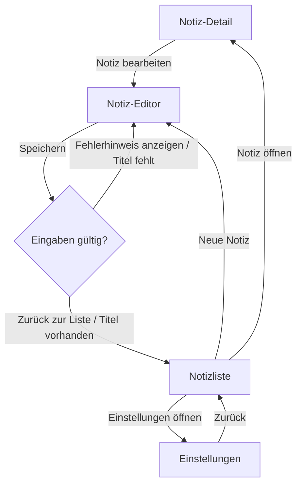

<div align="center">

# Ductus

**English** | [Deutsch](./README.de.md) | [Español](./README.es.md) | [简体中文](./README.zh-CN.md)

**End-user documentation that cannot lie — extracted from your code, grounded in the journey graph, translated by an LLM with your own API key.**

[](https://github.com/PlaxXOnline/ductus/actions/workflows/ci.yml?query=branch%3Amain)
[](https://www.npmjs.com/package/@ductus/core)
[](https://pub.dev/packages/ductus)
[](https://pub.dev/packages/ductus/score)
[](packages/core/package.json)
[](dart/ductus/pubspec.yaml)
[](LICENSE)

**[View the live demo →](https://plaxxonline.github.io/ductus/)** · [Quick start](#quick-start) · [With vs. without an LLM](#with-vs-without-an-llm) · [LLM layer](#the-llm-layer-in-detail) · [Packages](#packages)

</div>

<picture>
  <source media="(prefers-color-scheme: dark)" srcset="docs/assets/pipeline-dark.svg">
  
</picture>

End-user documentation goes stale faster than it gets written: every new
route, every renamed button silently makes guides wrong. Ductus therefore
extracts a directed graph of the user journey straight from annotated source
code (Dart/Flutter and TypeScript/JavaScript) and translates it via an LLM —
with your own API key (BYOK) — into well-kept end-user docs as MDX files or a
static website. Graph and docs are versioned with the code; a **faithfulness
judge** ensures the generated text claims nothing that is not in the graph.

- **No backend, no account:** everything runs locally through the CLI.
  Supported LLM providers are `anthropic`, `openai`, `mistral`, an
  OpenAI-compatible endpoint (`custom` + `baseUrl` — including local ones,
  e.g. Ollama), or `mock` (deterministic, network-free — for tests/CI).
- **Graph-grounded generation:** the LLM only translates the validated
  graph; the faithfulness judge checks the output against it and flags
  uncovered claims visibly in the output and in the report.
- **Language-agnostic core + language adapters** (like LSP/tree-sitter): an
  adapter is a standalone CLI that emits exactly one canonical graph JSON on
  stdout. New languages only need such an adapter — no core changes.

## Live demo

The **[demo site](https://plaxxonline.github.io/ductus/)** was generated
entirely by Ductus — from the `@journey:` comments of the sample app
[`examples/flutter_comment_demo`](examples/flutter_comment_demo), with no
manual touch-ups. Interactive journey graph, step list from the main path,
⌘K search — note that the sample app is German-language, so the demo content
is currently German sample output (German remains a fully supported output
language):

<a href="https://plaxxonline.github.io/ductus/journeys/notes/">
  
</a>

The warning badge in the top-right corner is part of the demo, too: the
faithfulness check transparently reports that the judge response of the
(deliberately tiny) demo model could not be parsed — Ductus never lets that
happen silently.

## Quick start

```bash
# In your Flutter project (with go_router):
dart pub add ductus                # annotations + adapter
npm install -g @ductus/core @ductus/adapter-dart

ductus init                        # detects pubspec.yaml, writes ductus.config.yaml
ductus extract                     # → journey-graph.json (usable without an LLM)
export DUCTUS_LLM_API_KEY=sk-…
ductus generate                    # → docs/*.mdx (or a website)
ductus graph --open                # inspect the graph as Mermaid/HTML
```

In a TypeScript/JavaScript project (e.g. React + react-router) the Dart side
drops out entirely:

```bash
npm install -g @ductus/core @ductus/adapter-typescript
ductus init && ductus extract && ductus generate
```

This is what a full run looks like — `extract` and `check` need no LLM, and
`generate` states its cost estimate before the first provider call happens:


## With vs. without an LLM

Ductus is **fully usable without an LLM** — the LLM is the last mile that
turns the validated graph into readable prose. A direct comparison, with
real (verbatim) artifacts from
[`examples/flutter_comment_demo`](examples/flutter_comment_demo)
(German-language sample content):

### Starting point: a comment in the code

```dart
// @journey:screen id="note-editor" title="Notiz-Editor" flow="notes"
//   description="Formular zum Anlegen oder Bearbeiten einer Notiz mit Titel und Inhalt."
class NoteEditorScreen extends StatelessWidget {
  // …
            // @journey:action label="Speichern"
            //   from="note-editor" to="save-check" trigger="submit"
            FilledButton(
              onPressed: () => _save(context, titleController.text),
              child: const Text('Speichern'),
            ),
```

### Without an LLM: `ductus extract` + `ductus graph` — zero cost, zero network

`extract` produces the validated graph in a byte-stable serialization — an
excerpt from `journey-graph.json`, trimmed to one node and one edge:

```json
{
  "edges": [
    {
      "from": "note-editor",
      "id": "e_note-editor_save-check",
      "label": "Speichern",
      "source": "annotation",
      "sourceRef": {
        "file": "lib/screens/note_editor_screen.dart",
        "line": 44,
        "symbol": "NoteEditorScreen"
      },
      "to": "save-check",
      "trigger": "submit"
    }
  ],
  "nodes": [
    {
      "description": "Formular zum Anlegen oder Bearbeiten einer Notiz mit Titel und Inhalt.",
      "flow": "notes",
      "id": "note-editor",
      "source": "annotation",
      "sourceRef": {
        "file": "lib/screens/note_editor_screen.dart",
        "line": 3,
        "symbol": "NoteEditorScreen"
      },
      "title": "Notiz-Editor",
      "type": "screen"
    }
  ]
}
```

`ductus graph` turns that into Mermaid — this is the unmodified output for
the demo app:



On top of that you get validation (start screens, unreachable nodes, cycles
without a `condition`, …) and `ductus-report.json` as a machine-readable CI
gate.

### With an LLM: `ductus generate` — the same graph becomes prose

Generated verbatim (deliberately with a very small model,
`ministral-3b-2512`; excerpt — German output for the German demo app):

> Dieser Abschnitt zeigt Ihnen, wie Sie in der **comment_demo**-App Notizen
> erstellen, bearbeiten oder anzeigen sowie die App-Einstellungen verwalten.
>
> **Notiz bearbeiten**
>
> 1. Öffnen Sie eine Notiz und tippen Sie auf **Notiz bearbeiten**.
>    *Voraussetzung: Sie befinden sich auf der Notiz-Detailseite.*
> 2. Bearbeiten Sie den Titel und den Inhalt der Notiz.
> 3. Tippen Sie auf **Speichern**.

The edge labels (**Speichern**, **Notiz bearbeiten**) are the real button
captions from the graph — the generation prompt forbids the LLM from
inventing UI elements that do not appear as a node, edge, or `label` in the
segment.

### The difference at a glance

|  | `extract` / `graph` / `check` | `generate` |
|---|---|---|
| **LLM / API key** | not needed | your own key (BYOK) or `mock` |
| **Cost** | none | upfront estimate; the segment cache avoids repeat charges |
| **Network** | none | only the provider call |
| **Result** | `journey-graph.json`, Mermaid diagrams, validation, report | end-user prose as MDX or a website |
| **Use** | CI gate, review, graph maintenance | docs release |

### And what if the LLM hallucinates?

Two layers of checks guard the generated text. A **deterministic vocabulary
check** (no LLM) compares every `**bold**` element marked up as UI in step
lines against the graph vocabulary — an invented button is guaranteed to
stand out. On top of that, a second LLM call — the **faithfulness judge** —
checks whether the text claims steps, conditions, or UI elements that are
not in the graph segment. The judge itself is not taken at its word: every
finding must quote the passage verbatim and name the missing element; both
are verified mechanically, refuted findings are dropped, and borderline
cases are kept as notes only. Confirmed hits land visibly in the output and
in the report:

```mdx
:::caution[Faithfulness warning]
The faithfulness judge found claims that are not covered by the journey graph:
- Click “Forgot password”: no such step in the graph.
:::
```

`llm.faithfulnessThreshold` (default `0`) turns this into a hard CI gate:
`generate`/`check` exit with code 2 as soon as the number of violations
exceeds the threshold.
A failure of the judge itself (an unparsable response) also counts as a
violation, conservatively — better a false warning than a silent pass.

## The LLM layer in detail

**BYOK — bring your own key.** Ductus has no backend and no account; all
providers are called via native `fetch`, without SDKs. The API key lives
exclusively in an environment variable (the config only knows its **name**,
`llm.apiKeyEnv`), is never logged, never persisted, and is stripped from
error messages.

| Provider | Endpoint | Notes |
|---|---|---|
| `anthropic` | `api.anthropic.com/v1/messages` | default; `model` defaults to `claude-sonnet-4-5` |
| `openai` | `api.openai.com/v1/chat/completions` | set `llm.model` explicitly |
| `mistral` | `api.mistral.ai/v1/chat/completions` | set `llm.model` explicitly |
| `custom` | `<llm.baseUrl>/chat/completions` | OpenAI-compatible; key optional — local endpoints too (Ollama, LM Studio) |
| `mock` | — | deterministic, network-free; for tests, CI, and `--offline` |

**Costs stay under control:**

- **Estimate before the run:** `generate` prints
  `Cost estimate (upfront): …` before the first provider call — with
  `llm.pricing` configured (price per 1M input/output tokens) also in USD.
- **Segment cache:** the graph is split into segments (per flow or per
  screen); the cache key is a SHA-256 over the canonical segment JSON plus
  prompt version, model, `voice`, and `locale`. Unchanged segments come from
  `.ductus/cache` — a repeat `generate` run after small graph changes only
  pays for the changed segments.
- **`ductus check` is free:** it validates and reads faithfulness from the
  segment cache — without a single LLM call. Ideal for CI.

**Grounded prompts:** shorter, graph-bound segments instead of one
monolithic prompt reduce hallucination and cost. The system prompt fixes the
role (“technical writer”), the target language, and the voice (`en-you`, the
default, or `formal-sie` / `informal-du` for German end-user docs), forbids
invented UI elements, and requires gaps to be flagged explicitly instead of
filled in.

**Exit codes** (all commands):

| Code | Meaning |
|---|---|
| `0` | success |
| `1` | validation error or merge conflict between adapter outputs |
| `2` | faithfulness violations above `llm.faithfulnessThreshold` |
| `3` | config, LLM, adapter, or website build error |

## CLI

| Command | Purpose |
|---|---|
| `ductus init [--force]` | Writes the commented `ductus.config.yaml` (overwrites only with `--force`) |
| `ductus extract` | Runs the adapters, merges + validates → `journey-graph.json` and `ductus-report.json` |
| `ductus generate [--build]` | extract + LLM generation → MDX or website; `--build` builds the exported website |
| `ductus check` | Validation + faithfulness from the segment cache — no LLM calls, no cost (CI) |
| `ductus graph [--open] [--out <path>] [--journey]` | Mermaid on stdout; `--open` renders HTML to `.ductus/graph.html`; `--journey` prints the flow main paths as `journey` diagrams |
| `ductus help [command]` | Prints a rich CLI overview — or, given a command name, that command's help |

Global options: `-c, --config <path>` (default `./ductus.config.yaml`) and
`--offline` — with it, `generate` is only allowed with `llm.provider: mock`,
`extract`/`check`/`graph` run fully locally anyway, and `--build` cannot be
combined with it (npm would need the network).

## Input paths

Four paths feed the graph; they can be combined freely (details and setup:
[dart/ductus](dart/ductus) for Dart/Flutter,
[packages/adapter-typescript](packages/adapter-typescript) for
TypeScript/JavaScript):

| Path | Mechanism | Languages | Best for |
|---|---|---|---|
| **A — comment convention** | `// @journey:screen id="…" title="…"` | Dart **and** TS/JS | Build-free, no dependency in the target project |
| **B — Dart annotations** | `@JourneyScreen`, `@JourneyAction`, `@JourneyDecision`, `@JourneyFlow` | Dart only | Type-safe; `ductus` as a regular dependency |
| **C — automatic derivation** | go_router/auto_route or react-router/Next.js analysis | Dart **and** TS/JS | A scaffold with no annotations at all |
| **D — build_runner builder** | `journey_builder` → `ductus_builder.g.json` | Dart only | Resolves non-literal constant annotation arguments |

In TypeScript/JavaScript there are deliberately only A and C: the language
needs neither typed annotations (B) nor a builder (D) — path A is the manual
route there, path C derives the scaffold from react-router or Next.js.

Merge rule: manual annotations override derived values field by field (given
the same ID); if two **manual** sources contradict each other, the run
aborts fail-fast with both source references.

**Build-free usage:** with the comment convention the target project needs
no dependency at all — a global install is enough:

```bash
# Dart/Flutter:
dart pub global activate ductus
npm install -g @ductus/core @ductus/adapter-dart
ductus extract

# TypeScript/JavaScript (the adapter is parse-only anyway):
npm install -g @ductus/core @ductus/adapter-typescript
ductus extract
```

## Website mode

With `output.format: website`, `ductus generate` exports a complete Astro
project to `output.dir`. The default generator is
[`journey`](templates/journey): a journey-centric, pure Astro template that
reads its data from exactly one `ductus.data.json` (a deterministic data
contract — no MDX files). With `output.website.generator: starlight` you get
a [Starlight project](templates/starlight) instead (MDX + sidebar/site
config) in which the Mermaid diagrams are rendered client-side.

<p>
  <a href="https://plaxxonline.github.io/ductus/"></a>
  <a href="https://plaxxonline.github.io/ductus/journeys/notes/"></a>
</p>

The journey template ships with: interactive journey graphs (clickable
nodes, a “play path” animation, deep links), ⌘K search across journeys,
steps, decisions, and actions, faithfulness banners, a source reference per
step (`file:line · symbol`), a responsive layout, and
`prefers-reduced-motion` support. Its UI is English by default and switches
to German when the configured locale starts with `de`. The LLM Markdown is
rendered XSS-safe at build time.

`ductus generate --build` installs the dependencies in the exported project
and runs `npm run build` — the finished, purely statically hostable website
then sits in `<output.dir>/dist`. The
[live demo](https://plaxxonline.github.io/ductus/) is produced the same way:
a [GitHub Actions workflow](.github/workflows/pages.yml) assembles the
journey template with the committed [`demo/ductus.data.json`](demo) and
builds it statically (`astro build`).

### Diagrams in the generated docs

With `output.website.diagrams: true` (the default), every flow page in MDX
or Starlight mode gets up to two Mermaid sections: the **main path** (a
linear `journey` diagram) and the **flowchart** of the full segment. The
main path is derived deterministically: starting at `flow.start`, Ductus
picks exactly one outgoing edge per step — non-`back` triggers before
`back`, edges without a `condition` before those with one, and the smallest
`edge.id` on a tie. The journey template does not need the Mermaid diagrams:
it renders the graph natively as an interactive view straight from
`ductus.data.json`.

## Configuration

`ductus init` reads your `pubspec.yaml` (app name, go_router/auto_route) —
or, without one, your `package.json` (app name, react-router/Next.js) — and
writes a commented `ductus.config.yaml`:

```yaml
app:
  name: MyApp
  locale: en

adapters:
  - dart:                      # or typescript: in TS/JS projects
      project: .
      deriveFrom: [go_router, auto_route]

llm:
  provider: anthropic          # anthropic | openai | mistral | custom | mock
  model: claude-sonnet-4-5
  apiKeyEnv: DUCTUS_LLM_API_KEY
  temperature: 0.2
  faithfulnessCheck: true

style:
  voice: en-you                # formal-sie | informal-du | en-you
  granularity: flow            # flow | screen

output:
  format: mdx                  # mdx | website
  dir: docs/
  website:
    generator: journey         # journey | starlight
    diagrams: true
```

Details worth knowing:

- `app.locale` (default `en`) is the language of the generated docs;
  `style.voice` (default `en-you`) sets the form of address — `formal-sie`
  and `informal-du` produce German end-user docs.
- `llm.apiKeyEnv` holds the **name** of the environment variable, never the
  key itself; `llm.baseUrl` is required with `provider: custom`.
- `llm.faithfulnessThreshold` (default `0`) sets how many judge findings
  make `generate`/`check` exit with code 2; `llm.maxTokens` (default `2048`)
  caps the response length per call.
- `llm.pricing` (`inputPerMTokUsd`/`outputPerMTokUsd`) is optional and turns
  the token estimate into a USD cost estimate.
- `output.website.generator: docusaurus` is accepted but not included in
  phase 1 — the run aborts with a pointer to `journey`/`starlight`.

## Best practices

How to get precise, graph-faithful, and inexpensive end-user docs out of
Ductus.

### Graph quality

- **Keep IDs stable; never repurpose them.** IDs are the merge identity,
  part of the segment cache key, and the sort key of the canonical output —
  a renamed ID means: the segment is regenerated (LLM cost) and the diff
  gets noisy. Descriptive kebab-case IDs like `submit-login` match the style
  of the derived IDs.
- **Write titles and `description`s from the end user's perspective, not
  code internals.** The faithfulness judge only checks whether the text
  claims something that is *not* in the graph — whatever is in the graph
  ends up in the docs. Missing `description`s are reported as a validation
  warning (V5) because LLM quality drops.
- **Edge `label` = the visible UI text.** Only the real button caption
  yields “Tap **Sign in**” instead of a vague paraphrase.
- **Assign every node to a flow, and a `condition` to every decision edge.**
  Nodes without a flow collect on a catch-all page without a main-path
  diagram. Validation also warns (V5) about unreachable nodes and about
  cycles in which no edge carries a `condition`; `flow.start` must exist and
  be a screen (V3, hard error).

### Combining input paths

- **Derivation as the base, annotations to sharpen.** Automatic derivation
  from go_router/auto_route or react-router/Next.js provides the scaffold;
  manual annotations override derived values field by field. To enrich a
  derived node, the annotation must use **the same ID** — the derived IDs
  are in `journey-graph.json` after `ductus extract`.
- **Never two manual sources for the same field.** If two manual sources
  contradict each other, the merge aborts fail-fast with both source
  references. Describe every element manually exactly once.
- **Path D for build_runner projects:** if you run `build_runner` anyway,
  let the `journey_builder` builder emit the graph as
  `ductus_builder.g.json` and feed it in via `fromBuilder: true` — with
  resolution of non-literal constant annotation arguments that a purely
  parsing adapter would have to reject (setup in [dart/ductus](dart/ductus)).

### Workflow

- **Get `extract` green first, then `generate`.** `ductus extract` and
  `ductus graph --open` run without an LLM and cost nothing — fix
  validation errors and warnings first, inspect the graph, and only then
  generate.
- **Version `journey-graph.json` and the generated docs with the code.**
  The graph is serialized byte-stable (deterministic sorting, LF, stable
  field order) — changes stay visible as clean diffs in review.
- **Do not hand-edit generated docs.** The next `generate` run rewrites the
  pages. Fixes belong in the graph — including for `:::caution`
  faithfulness warnings: sharpen `description`, `label`, `condition`
  instead of patching text.
- **Run `ductus check` in CI.** No LLM calls, no cost; the
  [exit codes above](#the-llm-layer-in-detail) apply. Segments without a
  cache entry are only reported as “not generated yet” (exit stays 0).

### LLM & cost

- **Stable IDs/titles avoid regeneration.** Changing the model, `voice`,
  `locale`, or `granularity`, on the other hand, invalidates all segments.
- **Keep `temperature` low and `faithfulnessCheck` on** (defaults `0.2`
  and `true`).
- **Tests/CI at zero cost:** `llm.provider: mock` (deterministic,
  network-free) plus `--offline`.

## Packages

| Package | Version | Source | Contents |
|---|---|---|---|
| `@ductus/schema` | [](https://www.npmjs.com/package/@ductus/schema) | [packages/schema](packages/schema) | Graph JSON Schema + TypeScript types |
| `@ductus/core` | [](https://www.npmjs.com/package/@ductus/core) | [packages/core](packages/core) | `ductus` CLI: merge/validation, LLM layer, MDX/website export |
| `@ductus/adapter-dart` | [](https://www.npmjs.com/package/@ductus/adapter-dart) | [packages/adapter-dart](packages/adapter-dart) | Thin wrapper delegating to the Dart adapter CLI |
| `@ductus/adapter-typescript` | [](https://www.npmjs.com/package/@ductus/adapter-typescript) | [packages/adapter-typescript](packages/adapter-typescript) | TS/JS adapter: `@journey:` comments + derivation from react-router/Next.js |
| `ductus` | [](https://pub.dev/packages/ductus) | [dart/ductus](dart/ductus) | Dart annotations, adapter CLI, build_runner builder |

All packages are [MIT-licensed](LICENSE) (each package ships its own LICENSE
file).

## Examples

The [sample apps](examples) show the input paths in action:

- [`flutter_comment_demo`](examples/flutter_comment_demo) — purely
  build-free comment convention (path A); source of the [live demo](https://plaxxonline.github.io/ductus/)
- [`flutter_go_router_demo`](examples/flutter_go_router_demo) — derivation
  from go_router (path C) + Dart annotations (path B)
- [`react_router_demo`](examples/react_router_demo) — React + react-router:
  derivation (path C) + `@journey:` comments (path A)

## Repository layout & development

```
packages/{schema,core,adapter-dart,adapter-typescript}   # npm packages (TypeScript)
dart/ductus                                              # pub.dev package (annotations + adapter + builder)
templates/                                               # website templates (journey = default, starlight)
examples/                                                # sample apps with annotations
demo/                                                    # data source of the GitHub Pages demo
```

```bash
npm install && npm run build && npm test      # TS packages
cd dart/ductus && dart pub get && dart test   # Dart adapter
```

CI ([.github/workflows/ci.yml](.github/workflows/ci.yml)) runs Node jobs
(build + Vitest), Dart jobs (`dart analyze` + `dart test`), and Flutter
analysis jobs on every push and pull request. Releases go through
[Changesets](RELEASING.md) with npm trusted publishing; please
[report security vulnerabilities privately](SECURITY.md).

## License

[MIT](LICENSE) for all packages in this repository.
