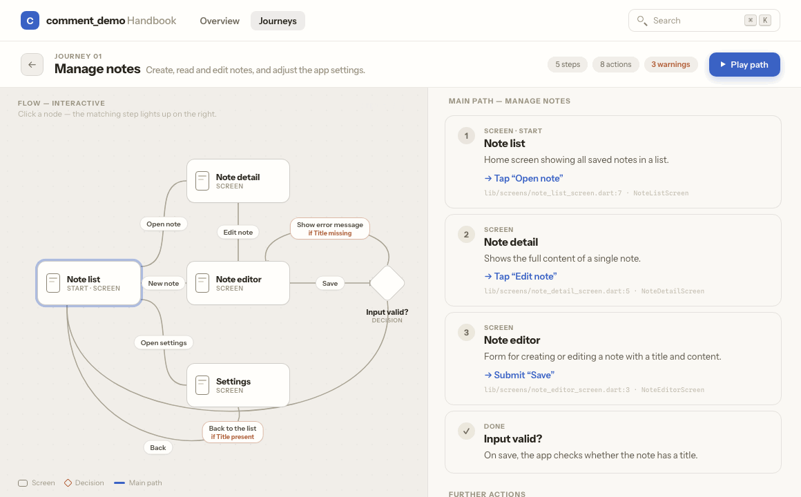
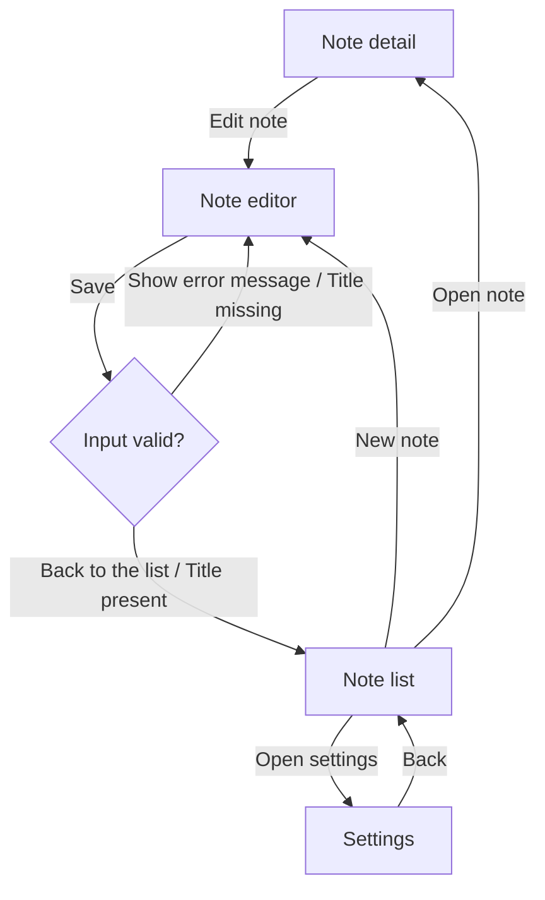
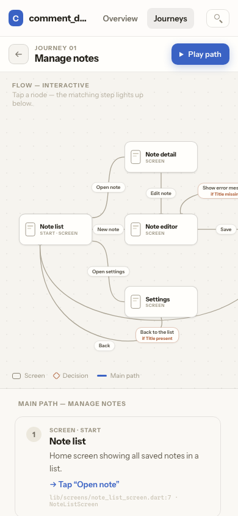

<div align="center">

# Ductus

[English](./README.md) | [Deutsch](./README.de.md) | [Español](./README.es.md) | **简体中文**

**不会说谎的最终用户文档——从你的代码中提取，以 journey graph（用户旅程图）为依据，由 LLM 使用你自己的 API 密钥转写而成。**

[](https://github.com/PlaxXOnline/ductus/actions/workflows/ci.yml?query=branch%3Amain)
[](https://www.npmjs.com/package/@ductus/core)
[](https://pub.dev/packages/ductus)
[](https://pub.dev/packages/ductus/score)
[](packages/core/package.json)
[](dart/ductus/pubspec.yaml)
[](LICENSE)

**[查看在线演示 →](https://plaxxonline.github.io/ductus/)** · [快速上手](#快速上手) · [有 LLM 与无 LLM 的对比](#有-llm-与无-llm-的对比) · [LLM 层详解](#llm-层详解) · [软件包](#软件包)

</div>

<picture>
  <source media="(prefers-color-scheme: dark)" srcset="docs/assets/pipeline-dark.svg">
  
</picture>

最终用户文档过时的速度往往比编写它的速度更快：每一条新路由、每一个被重命名的按钮，
都会悄无声息地让指南出错。因此，Ductus 直接从带注解的源代码（Dart/Flutter 和
TypeScript/JavaScript）中提取用户旅程的有向图，并通过 LLM——使用你自己的
API 密钥（BYOK）——将其转写为维护良好的最终用户文档，输出为 MDX 文件或静态网站。
图和文档与代码一同进行版本管理；**faithfulness judge（忠实性裁判）** 确保生成的文本不会声称任何图中不存在的内容。

- **无后端、无账号：**一切都在本地通过 CLI 运行。支持的 LLM 提供商有
  `anthropic`、`openai`、`mistral`、OpenAI 兼容端点（`custom` + `baseUrl`——
  也包括本地端点，例如 Ollama），以及 `mock`（确定性、无网络——用于测试/CI）。
- **以图为依据的生成：** LLM 只转写经过校验的图；faithfulness judge 会将输出与图进行比对，
  并在输出和报告中显著标记未被覆盖的表述。
- **语言无关的核心 + 语言适配器**（类似 LSP/tree-sitter）：适配器是一个独立的 CLI，
  在 stdout 上恰好输出一份规范化的图 JSON。新语言只需要这样一个适配器——无需改动核心。

## 在线演示

**[演示站点](https://plaxxonline.github.io/ductus/)**完全由 Ductus 生成——
来自示例应用 [`examples/flutter_comment_demo`](examples/flutter_comment_demo)
中的 `@journey:` 注释，未经任何手工修饰。交互式 journey graph、来自主路径的步骤列表、
⌘K 搜索——请注意，已部署的演示仍展示此前的德语运行结果；示例应用本身现已是英文
（德语仍是完全受支持的输出语言）：

<a href="https://plaxxonline.github.io/ductus/journeys/notes/">
  
</a>

右上角的警告徽章同样是演示的一部分：faithfulness 检查透明地报告了
（刻意选用的极小）演示模型的 judge 响应无法被解析——Ductus 绝不会让这种情况悄然发生。

## 快速上手

```bash
# 在你的 Flutter 项目中（使用 go_router）：
dart pub add ductus                # 注解 + 适配器
npm install -g @ductus/core @ductus/adapter-dart

ductus init                        # 检测 pubspec.yaml，写入 ductus.config.yaml
ductus extract                     # → journey-graph.json（无需 LLM 即可使用）
export DUCTUS_LLM_API_KEY=sk-…
ductus generate                    # → docs/*.mdx（或一个网站）
ductus graph --open                # 以 Mermaid/HTML 形式查看图
```

在 TypeScript/JavaScript 项目中（例如 React + react-router），Dart 那一侧可以完全省去：

```bash
npm install -g @ductus/core @ductus/adapter-typescript
ductus init && ductus extract && ductus generate
```

一次完整运行看起来是这样的——`extract` 和 `check` 不需要 LLM，
而 `generate` 会在第一次调用提供商之前给出成本预估：



## 有 LLM 与无 LLM 的对比

Ductus **完全可以在没有 LLM 的情况下使用**——LLM 只是把经过校验的图变成可读文本的最后一步。
下面是直接对比，使用来自
[`examples/flutter_comment_demo`](examples/flutter_comment_demo)
的真实（逐字）产物：

### 起点：代码中的一条注释

```dart
// @journey:screen id="note-editor" title="Note editor" flow="notes"
//   description="Form for creating or editing a note with a title and content."
class NoteEditorScreen extends StatelessWidget {
  // …
            // @journey:action label="Save"
            //   from="note-editor" to="save-check" trigger="submit"
            FilledButton(
              onPressed: () => _save(context, titleController.text),
              child: const Text('Save'),
            ),
```

### 无 LLM：`ductus extract` + `ductus graph`——零成本、零网络

`extract` 以字节级稳定的序列化形式生成经过校验的图——
以下是 `journey-graph.json` 的节选，删减为一个节点和一条边：

```json
{
  "edges": [
    {
      "from": "note-editor",
      "id": "e_note-editor_save-check",
      "label": "Save",
      "source": "annotation",
      "sourceRef": {
        "file": "lib/screens/note_editor_screen.dart",
        "line": 44,
        "symbol": "NoteEditorScreen"
      },
      "to": "save-check",
      "trigger": "submit"
    }
  ],
  "nodes": [
    {
      "description": "Form for creating or editing a note with a title and content.",
      "flow": "notes",
      "id": "note-editor",
      "source": "annotation",
      "sourceRef": {
        "file": "lib/screens/note_editor_screen.dart",
        "line": 3,
        "symbol": "NoteEditorScreen"
      },
      "title": "Note editor",
      "type": "screen"
    }
  ]
}
```

`ductus graph` 会将其转换为 Mermaid——这是针对演示应用的未经修改的输出：



除此之外，你还会得到校验（起始屏幕、不可达节点、没有 `condition` 的循环等），
以及作为机器可读 CI 门禁的 `ductus-report.json`。

### 有 LLM：`ductus generate`——同一张图变成文档正文

逐字生成的结果（刻意选用了一个非常小的模型 `ministral-3b-2512`；
节选——来自演示应用此前德语运行的德语输出）：

> Dieser Abschnitt zeigt Ihnen, wie Sie in der **comment_demo**-App Notizen
> erstellen, bearbeiten oder anzeigen sowie die App-Einstellungen verwalten.
>
> **Notiz bearbeiten**
>
> 1. Öffnen Sie eine Notiz und tippen Sie auf **Notiz bearbeiten**.
>    *Voraussetzung: Sie befinden sich auf der Notiz-Detailseite.*
> 2. Bearbeiten Sie den Titel und den Inhalt der Notiz.
> 3. Tippen Sie auf **Speichern**.

边上的标签（**Speichern**、**Notiz bearbeiten**）正是图中真实的按钮文字——
生成提示词禁止 LLM 编造未以节点、边或 `label` 形式出现在该分段中的 UI 元素。

### 差异一览

|  | `extract` / `graph` / `check` | `generate` |
|---|---|---|
| **LLM / API 密钥** | 不需要 | 你自己的密钥（BYOK）或 `mock` |
| **成本** | 无 | 事先预估；分段缓存可避免重复计费 |
| **网络** | 无 | 仅有对提供商的调用 |
| **结果** | `journey-graph.json`、Mermaid 图、校验、报告 | 以 MDX 或网站形式呈现的最终用户文档 |
| **用途** | CI 门禁、评审、图的维护 | 文档发布 |

### 如果 LLM 产生幻觉怎么办？

两层检查共同守护生成的文本。**确定性词汇检查**（不使用 LLM）会将步骤行中标记为
UI 的每一个 `**加粗**` 元素与图词汇表进行比对——任何被编造的按钮都必然会暴露出来。
在此之上，还有第二次 LLM 调用——**faithfulness judge**——检查文本是否声称了
图分段中不存在的步骤、条件或 UI 元素。judge 本身的话也不会被直接采信：
每条发现都必须逐字引用相关段落并指出缺失的元素；两者都会以机械方式校验，
被驳回的发现会被丢弃，边界情况仅作为备注保留。确认的命中会显著地出现在输出和报告中：

```mdx
:::caution[Faithfulness warning]
The faithfulness judge found claims that are not covered by the journey graph:
- Click “Forgot password”: no such step in the graph.
:::
```

`llm.faithfulnessThreshold`（默认 `0`）可以把这变成一道硬性 CI 门禁：
一旦违规数量超过阈值，`generate`/`check` 就以退出码 2 结束。
judge 自身的失败（无法解析的响应）也会被保守地计为一次违规——宁可误报，也不放过。

## LLM 层详解

**BYOK——自带 API 密钥。** Ductus 没有后端，也没有账号；所有提供商都通过原生
`fetch` 调用，不使用 SDK。API 密钥只存在于环境变量中（配置只知道它的**名称**，即
`llm.apiKeyEnv`），永远不会被记录到日志、不会被持久化，并且会从错误消息中剔除。

| 提供商 | 端点 | 说明 |
|---|---|---|
| `anthropic` | `api.anthropic.com/v1/messages` | 默认；`model` 默认为 `claude-sonnet-4-5` |
| `openai` | `api.openai.com/v1/chat/completions` | 需显式设置 `llm.model` |
| `mistral` | `api.mistral.ai/v1/chat/completions` | 需显式设置 `llm.model` |
| `custom` | `<llm.baseUrl>/chat/completions` | OpenAI 兼容；密钥可选——也支持本地端点（Ollama、LM Studio） |
| `mock` | — | 确定性、无网络；用于测试、CI 和 `--offline` |

**成本始终可控：**

- **运行前预估：** `generate` 会在第一次调用提供商之前打印
  `Cost estimate (upfront): …`——配置了 `llm.pricing`
  （每 100 万输入/输出 token 的价格）后还会给出美元金额。
- **分段缓存：**图会被拆分为若干分段（按 flow 或按屏幕）；缓存键是对规范化的分段
  JSON 加上提示词版本、模型、`voice` 和 `locale` 计算的 SHA-256。未变更的分段直接来自
  `.ductus/cache`——在小幅图变更之后重新运行 `generate`，只需为变更过的分段付费。
- **`ductus check` 免费：**它执行校验并从分段缓存中读取 faithfulness 结果——
  不发起任何 LLM 调用。非常适合 CI。

**以图为依据的提示词：**用更短、绑定到图的分段代替单个庞大的提示词，
可同时降低幻觉和成本。系统提示词固定了角色（“technical writer”）、目标语言和 voice
（默认为 `en-you`，或用于德语最终用户文档的 `formal-sie` / `informal-du`），
禁止编造 UI 元素，并要求显式标记空缺而不是自行补全。

**退出码**（所有命令）：

| 代码 | 含义 |
|---|---|
| `0` | 成功 |
| `1` | 校验错误或适配器输出之间的合并冲突 |
| `2` | faithfulness 违规数超过 `llm.faithfulnessThreshold` |
| `3` | 配置、LLM、适配器或网站构建错误 |

## CLI

| 命令 | 用途 |
|---|---|
| `ductus init [--force]` | 写入带注释的 `ductus.config.yaml`（仅在使用 `--force` 时覆盖） |
| `ductus extract` | 运行适配器，合并 + 校验 → `journey-graph.json` 和 `ductus-report.json` |
| `ductus generate [--build]` | extract + LLM 生成 → MDX 或网站；`--build` 会构建导出的网站 |
| `ductus check` | 校验 + 从分段缓存读取 faithfulness——不调用 LLM、零成本（CI） |
| `ductus graph [--open] [--out <path>] [--journey]` | 在 stdout 上输出 Mermaid；`--open` 将 HTML 渲染到 `.ductus/graph.html`；`--journey` 以 `journey` 图形式打印各 flow 的主路径 |
| `ductus help [command]` | 打印内容丰富的 CLI 总览——若给出命令名，则打印该命令的帮助 |

全局选项：`-c, --config <path>`（默认 `./ductus.config.yaml`）和 `--offline`——
启用后，`generate` 仅允许在 `llm.provider: mock` 下运行，
`extract`/`check`/`graph` 本来就完全在本地运行，
而 `--build` 不能与其组合使用（npm 需要联网）。

## 输入路径

有四条路径可以为图提供输入；它们可以自由组合（细节与配置：Dart/Flutter 参见
[dart/ductus](dart/ductus)，TypeScript/JavaScript 参见
[packages/adapter-typescript](packages/adapter-typescript)）：

| 路径 | 机制 | 语言 | 最适合 |
|---|---|---|---|
| **A——注释约定** | `// @journey:screen id="…" title="…"` | Dart **和** TS/JS | 无需构建，目标项目中不需要任何依赖 |
| **B——Dart 注解** | `@JourneyScreen`、`@JourneyAction`、`@JourneyDecision`、`@JourneyFlow` | 仅 Dart | 类型安全；将 `ductus` 作为常规依赖 |
| **C——自动推导** | go_router/auto_route 或 react-router/Next.js 分析 | Dart **和** TS/JS | 完全不写注解即可得到骨架 |
| **D——build_runner 构建器** | `journey_builder` → `ductus_builder.g.json` | 仅 Dart | 解析非字面量的常量注解参数 |

在 TypeScript/JavaScript 中刻意只提供 A 和 C：这门语言既不需要类型化注解（B），
也不需要构建器（D）——路径 A 是那里的手动方式，
路径 C 从 react-router 或 Next.js 推导出骨架。

合并规则：手动注解会逐字段覆盖推导出的值（前提是 ID 相同）；
如果两个**手动**来源相互矛盾，运行会快速失败并中止，同时给出两处来源引用。

**免构建使用：**采用注释约定时，目标项目完全不需要任何依赖——全局安装即可：

```bash
# Dart/Flutter:
dart pub global activate ductus
npm install -g @ductus/core @ductus/adapter-dart
ductus extract

# TypeScript/JavaScript（该适配器本来就只做解析）：
npm install -g @ductus/core @ductus/adapter-typescript
ductus extract
```

## 网站模式

设置 `output.format: website` 后，`ductus generate` 会将一个完整的 Astro 项目导出到
`output.dir`。默认生成器是 [`journey`](templates/journey)：一个以 journey 为中心的纯
Astro 模板，其数据只从唯一的一份 `ductus.data.json` 读取（确定性的数据契约——
没有 MDX 文件）。设置 `output.website.generator: starlight` 则会得到一个
[Starlight 项目](templates/starlight)（MDX + 侧边栏/站点配置），
其中的 Mermaid 图在客户端渲染。

<p>
  <a href="https://plaxxonline.github.io/ductus/"></a>
  <a href="https://plaxxonline.github.io/ductus/journeys/notes/"></a>
</p>

journey 模板自带：交互式 journey graph（可点击的节点、“play path”动画、深层链接）、
覆盖 journey、步骤、决策和操作的 ⌘K 搜索、faithfulness 横幅、
每个步骤的来源引用（`file:line · symbol`）、响应式布局，
以及对 `prefers-reduced-motion` 的支持。其 UI 默认为英文，
当配置的 locale 以 `de` 开头时会切换为德语。
LLM 生成的 Markdown 会在构建时以防 XSS 的方式渲染。

`ductus generate --build` 会在导出的项目中安装依赖并运行 `npm run build`——
构建完成后，可纯静态托管的网站就位于 `<output.dir>/dist`。
[在线演示](https://plaxxonline.github.io/ductus/)也是以同样的方式产出的：
一个 [GitHub Actions 工作流](.github/workflows/pages.yml)将 journey 模板与已提交的
[`demo/ductus.data.json`](demo) 组装起来并进行静态构建（`astro build`）。

### 生成文档中的图表

设置 `output.website.diagrams: true`（默认值）后，MDX 或 Starlight 模式下的每个 flow
页面最多会得到两个 Mermaid 区块：**主路径**（一个线性的 `journey` 图）
和完整分段的**流程图**。主路径的推导是确定性的：从 `flow.start` 出发，Ductus
在每一步恰好选择一条出边——非 `back` 触发器优先于 `back`，
没有 `condition` 的边优先于有 `condition` 的边，打平时选择最小的 `edge.id`。
journey 模板并不需要这些 Mermaid 图：它直接从 `ductus.data.json`
以原生方式将图渲染为交互式视图。

## 配置

`ductus init` 会读取你的 `pubspec.yaml`（应用名称、go_router/auto_route）——
若不存在，则读取 `package.json`（应用名称、react-router/Next.js）——
并写入一份带注释的 `ductus.config.yaml`：

```yaml
app:
  name: MyApp
  locale: en

adapters:
  - dart:                      # 在 TS/JS 项目中则为 typescript:
      project: .
      deriveFrom: [go_router, auto_route]

llm:
  provider: anthropic          # anthropic | openai | mistral | custom | mock
  model: claude-sonnet-4-5
  apiKeyEnv: DUCTUS_LLM_API_KEY
  temperature: 0.2
  faithfulnessCheck: true

style:
  voice: en-you                # formal-sie | informal-du | en-you
  granularity: flow            # flow | screen

output:
  format: mdx                  # mdx | website
  dir: docs/
  website:
    generator: journey         # journey | starlight
    diagrams: true
```

值得了解的细节：

- `app.locale`（默认 `en`）是生成文档所用的语言；`style.voice`（默认 `en-you`）
  设定称呼方式——`formal-sie` 和 `informal-du` 会生成德语最终用户文档。
- `llm.apiKeyEnv` 保存的是环境变量的**名称**，绝不是密钥本身；
  使用 `provider: custom` 时必须设置 `llm.baseUrl`。
- `llm.faithfulnessThreshold`（默认 `0`）设定多少条 judge 发现会让
  `generate`/`check` 以退出码 2 结束；`llm.maxTokens`（默认 `2048`）
  限制每次调用的响应长度。
- `llm.pricing`（`inputPerMTokUsd`/`outputPerMTokUsd`）是可选项，
  可将 token 预估转换为美元成本预估。
- `output.website.generator: docusaurus` 会被接受，但不包含在第一阶段中——
  运行会中止，并提示改用 `journey`/`starlight`。

## 最佳实践

如何用 Ductus 得到精确、忠实于图且成本低廉的最终用户文档。

### 图的质量

- **保持 ID 稳定；绝不挪作他用。** ID 是合并时的身份标识、分段缓存键的一部分，
  也是规范化输出的排序键——重命名一个 ID 意味着：该分段会被重新生成（产生 LLM 成本），
  diff 也会变得嘈杂。像 `submit-login` 这样具有描述性的 kebab-case ID
  与推导出的 ID 风格一致。
- **从最终用户的视角撰写标题和 `description`，而不是代码内部细节。**
  faithfulness judge 只检查文本是否声称了图中*没有*的内容——图中有什么，
  文档里最终就会出现什么。缺失的 `description` 会作为校验警告（V5）被报告，
  因为 LLM 的质量会随之下降。
- **边的 `label` = 可见的 UI 文本。**只有真实的按钮文字才能得到
  “点按 **Sign in**”这样的表述，而不是含糊的转述。
- **给每个节点分配一个 flow，给每条决策边一个 `condition`。**
  没有 flow 的节点会汇集到一个没有主路径图的兜底页面上。
  校验还会对不可达节点以及没有任何一条边携带 `condition` 的循环发出警告（V5）；
  `flow.start` 必须存在且必须是一个屏幕（V3，硬性错误）。

### 组合输入路径

- **以推导为基础，用注解来锐化。**从 go_router/auto_route 或 react-router/Next.js
  的自动推导提供骨架；手动注解逐字段覆盖推导出的值。若要丰富一个推导出的节点，
  注解必须使用**相同的 ID**——运行 `ductus extract` 之后，
  推导出的 ID 可以在 `journey-graph.json` 中找到。
- **同一字段绝不能有两个手动来源。**如果两个手动来源相互矛盾，
  合并会快速失败并中止，同时给出两处来源引用。每个元素只手动描述一次。
- **build_runner 项目走路径 D：**如果你本来就在运行 `build_runner`，
  就让 `journey_builder` 构建器把图输出为 `ductus_builder.g.json`，
  再通过 `fromBuilder: true` 传入——这样可以解析非字面量的常量注解参数，
  而纯解析型适配器只能拒绝它们（配置见 [dart/ductus](dart/ductus)）。

### 工作流程

- **先让 `extract` 通过，再运行 `generate`。** `ductus extract` 和
  `ductus graph --open` 不需要 LLM、不产生任何成本——先修复校验错误和警告、
  检查图，然后再生成。
- **将 `journey-graph.json` 和生成的文档与代码一起进行版本管理。**
  图以字节级稳定的方式序列化（确定性排序、LF、稳定的字段顺序）——
  变更在评审中始终以干净的 diff 呈现。
- **不要手动编辑生成的文档。**下一次 `generate` 运行会重写这些页面。
  修复应当落在图里——包括针对 `:::caution` faithfulness 警告：
  锐化 `description`、`label`、`condition`，而不是修补文本。
- **在 CI 中运行 `ductus check`。**不调用 LLM、零成本；
  适用[上文的退出码](#llm-层详解)。没有缓存条目的分段只会被报告为
  “not generated yet”（退出码保持 0）。

### LLM 与成本

- **稳定的 ID/标题可避免重新生成。**相反，更改模型、`voice`、`locale` 或
  `granularity` 会使所有分段失效。
- **保持较低的 `temperature`，并开启 `faithfulnessCheck`**（默认分别为 `0.2`
  和 `true`）。
- **零成本的测试/CI：** `llm.provider: mock`（确定性、无网络）加上 `--offline`。

## 软件包

| 软件包 | 版本 | 源码 | 内容 |
|---|---|---|---|
| `@ductus/schema` | [](https://www.npmjs.com/package/@ductus/schema) | [packages/schema](packages/schema) | 图的 JSON Schema + TypeScript 类型 |
| `@ductus/core` | [](https://www.npmjs.com/package/@ductus/core) | [packages/core](packages/core) | `ductus` CLI：合并/校验、LLM 层、MDX/网站导出 |
| `@ductus/adapter-dart` | [](https://www.npmjs.com/package/@ductus/adapter-dart) | [packages/adapter-dart](packages/adapter-dart) | 委托给 Dart 适配器 CLI 的轻量包装 |
| `@ductus/adapter-typescript` | [](https://www.npmjs.com/package/@ductus/adapter-typescript) | [packages/adapter-typescript](packages/adapter-typescript) | TS/JS 适配器：`@journey:` 注释 + 从 react-router/Next.js 推导 |
| `ductus` | [](https://pub.dev/packages/ductus) | [dart/ductus](dart/ductus) | Dart 注解、适配器 CLI、build_runner 构建器 |

所有软件包均采用 [MIT 许可证](LICENSE)（每个软件包都附带自己的 LICENSE 文件）。

## 示例

[示例应用](examples)展示了各输入路径的实际用法：

- [`flutter_comment_demo`](examples/flutter_comment_demo)——纯免构建的注释约定（路径 A）；
  [在线演示](https://plaxxonline.github.io/ductus/)的数据来源
- [`flutter_go_router_demo`](examples/flutter_go_router_demo)——从 go_router
  推导（路径 C）+ Dart 注解（路径 B）
- [`react_router_demo`](examples/react_router_demo)——React + react-router：
  推导（路径 C）+ `@journey:` 注释（路径 A）

## 仓库结构与开发

```
packages/{schema,core,adapter-dart,adapter-typescript}   # npm 包（TypeScript）
dart/ductus                                              # pub.dev 包（注解 + 适配器 + 构建器）
templates/                                               # 网站模板（journey = 默认，starlight）
examples/                                                # 带注解的示例应用
demo/                                                    # GitHub Pages 演示的数据来源
```

```bash
npm install && npm run build && npm test      # TS 包
cd dart/ductus && dart pub get && dart test   # Dart 适配器
```

CI（[.github/workflows/ci.yml](.github/workflows/ci.yml)）会在每次 push 和 pull request
上运行 Node 任务（构建 + Vitest）、Dart 任务（`dart analyze` + `dart test`）
以及 Flutter 分析任务。发布通过 [Changesets](RELEASING.md) 配合 npm trusted publishing
完成；请[以私密方式报告安全漏洞](SECURITY.md)。

## 许可证

本仓库中的所有软件包均采用 [MIT](LICENSE) 许可证。
